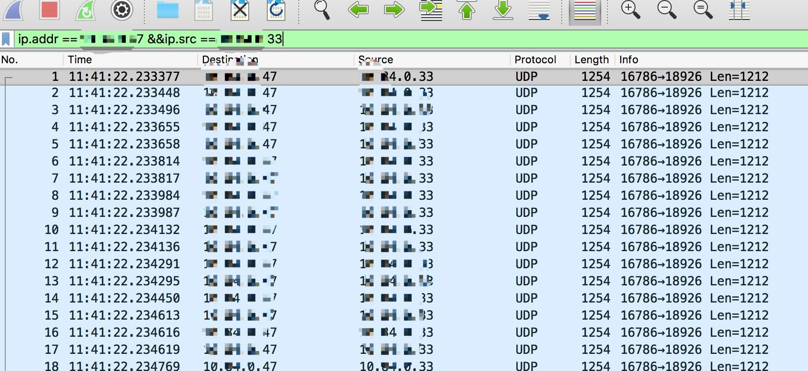
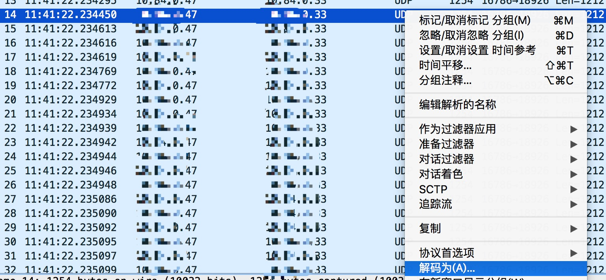
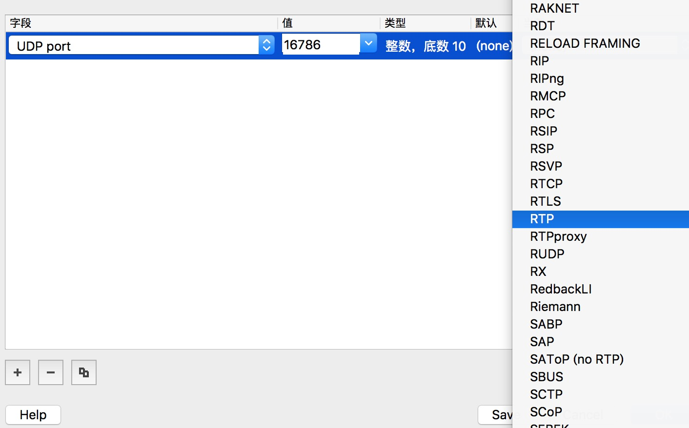
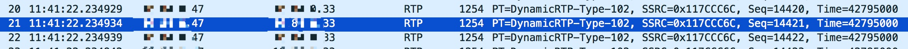
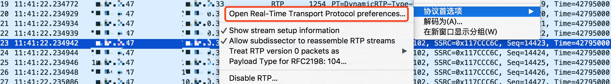
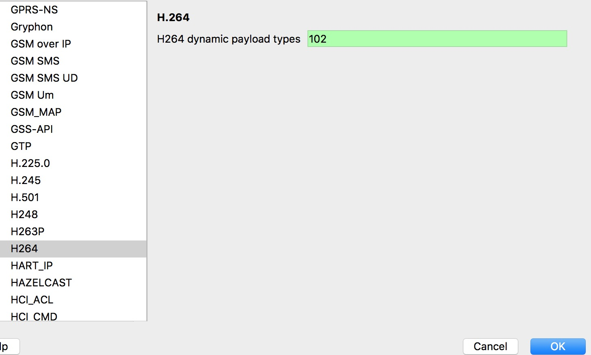
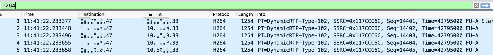

# 如何查看视频丢失问题

FreeSWITCH支持视频会议功能，我们也在此基础上，开发了一套我们自己的视频会议系统。在使用过程中，有时客户反映部分用户通一个会议中，看到的视频有卡顿，但其他用户观看正常。根据经验，多半为网络丢包，导致部分视频丢失。但是客户通常不承认是线路问题，此时，如何证明呢？抓包！

## 解决过程

### 问题重现并抓包

问题重现，然后在服务器以及客户端同时抓包；

在服务器上通过指令`tcpdump -w voice.pcap host xx.xx.xx.33`,其中`192.168.3.11`为`FreeSWITCH`地址。同理，在客户端抓包。

### 分析视频包

打开`wireshark`，导入上述视频包---voice.pcap。在输入框中输入`ip.addr == xx.xx.xx.47 &&ip.src == xx.xx.xx.33`,此目的是刷选FS到客户端发出去的包，如下图。（切记，选取视频包，视频包大小比音频高）



筛选完成后，选择其中一路，点击右键，然后选择解码为`RTP`,如下图所示：







然后选择一路，然后点击右键，选择“协议首选项”，将`102`设置为`H264`，保存，并在输入框内输入`h264`,筛选出H264编码视频流，如下图：







走到这一步，即获取了我们想要的视频流，点击文件,重新命名，如voice2.pcap,保存即可。

### 播放

下载`mod_pcap`并编译,进入FS后台执行加载此模块。然后在路由里建立路由如下：

```
<extension name="play pcap">
   <condition field="destination_number" expression="^(888)$">
    <action application="answer" data=""/>
    <action application="sleep" data="1000"/>
    <action application="play_pcap" data="/tmp/voice2.pcap"/>
   </condition>
 </extension>

```
使用支持视频的SIP客户端，注册账号，拨打888，即可看到抓包播放出的视频。若视频无丢失，说明FS发出去的视频正常。

### 客户端分析

同理，在客户端抓包，按照上述方法，筛选出同时间段客户端接受的包，然后使用`mod_pcap`播放视频流。如果视频有丢失，说明，线路上出现了丢包，可以通知客户查看网络状态了。

如何查看网络状态，请看下一章。


