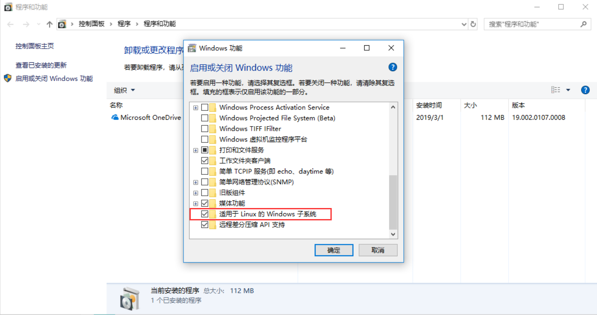
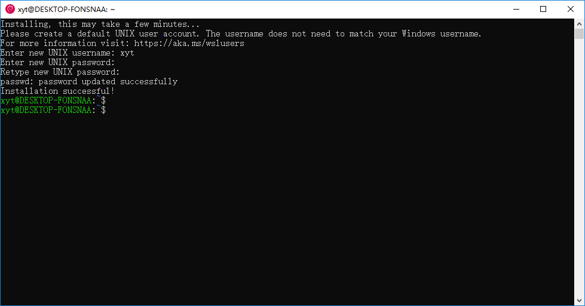

# 在Windows Subsystem Linux内使用FreeSWITCH

## WSL简介
Windows Subsystem Linux (简称：WSL) 是windows系统开发的一套基于windows 内核api调用的linux子系统，它跟传统意义上的虚拟机不一样。wsl内的进程跟win系统上的进程是平行关系，在win的任务管理器里面都可以查到。而且在wsl内也可以调用win上的win32程序，比如`pip.exe list|grep pip`这个命令，就是调用win系统内的pip.exe程序，获取其安装过的依赖包，然后将标准输出送给bash，再用grep来过滤字符。

本文的目的是简单尝试下在win10系统上更好的使用FreeSWITCH去进行安装和性能测试，这样好方便大家做个简单的性能对比。


## 启用WSL

WSL默认是没有开启的，需要在“控制面板->程序->程序和功能->启用或关闭Windows功能”子项内勾选它，使其启用。

启用后，还需要打开微软应用商店内安装对应的linux发行版本，比如`Ubuntu`,`OpenSUSE`，`Debian`等。本文采用的是`Debian`，直接搜索`Debian`然后下载安装即可。

## 登录WSL

`Debian`安装完成后，可以在开始菜单直接搜索它，然后启动即可；或者在cmd命令行下输入`bash`，也可直接进入WSL系统。在初次使用WSL的时候，会提示你创建一个新的普通用户和密码，如下图：

设置好用户名和密码即可正常使用。


## 源码编译安装FreeSWITCH的master分支
这里选用FreeSWITCH的master分支，进行编译安装和测试。首先进入WSL后，使用`sudo -i`切换到root用户模式（下面操作都在root用户环境下）。
### 更换apt源
默认使用的官方源速度较慢，需要先把源地址更换为国内的，此处以163的源为例：
```
nano /etc/apt/sources.list
```
使用nano编辑器打开`/etc/apt/sources.list`文件，将原内容删除，替换为下面内容：
```
deb http://mirrors.163.com/debian stretch main
deb http://mirrors.163.com/debian stretch-updates main
deb http://mirrors.163.com/debian-security/ stretch/updates main
```
除了修改`debian`系统的标准包的源，我们还需要加入`FreeSWICH`的master分支的源：
```
wget -O - https://files.freeswitch.org/repo/deb/debian-unstable/freeswitch_archive_g0.pub | apt-key add -
 
echo "deb http://files.freeswitch.org/repo/deb/debian-unstable/ stretch main" > /etc/apt/sources.list.d/freeswitch.list
echo "deb-src http://files.freeswitch.org/repo/deb/debian-unstable/ stretch main" >> /etc/apt/sources.list.d/freeswitch.list
```

全部修改完毕后，使用`apt-get update`命令更新下包列表。

###  安装编译FreeSWITCH
 
包列表更新过后，就可以安装编译FreeSWITCH所需要的依赖包：

```
apt-get build-dep freeswitch
```
接下来下载FreeSWITCH源码
```
cd /usr/src/
git clone https://freeswitch.org/stash/scm/fs/freeswitch.git freeswitch
cd freeswitch
```
开始编译安装：
```
./bootstrap.sh -j 
./configure
make
make install
```
下面这个命令是安装声音文件的，本文主要是测试FreeSWITCH性能，所以可以跳过此步骤：
```
make cd-sounds-install cd-moh-install
```

## 测试不同环境FreeSWITCH的CPU占比

这里主要对比下FreeSWITCH在WSL环境下和Linux环境下，使用相同的sipp参数进行压力测试观察cpu的占比。

### 测试机配置

FreeSWITCH服务器
* 处理器： i5-7400 
* 内存：8G
* 固态硬盘: 256G
* 网卡工作模式：百兆全双工

SipP测试机

* 处理器：i5-2450M
* 内存: 8G
* 固态硬盘：256G
* 网卡工作模式：百兆全双工

### 测试场景

使用sipp以40cps的速度进行呼叫测试，每个通话保持10秒。当FreeSWITCH上的并发稳定在400左右后，开始记录在不同环境下cpu的使用率。数据记录间隔是1s，然后记录5分钟左右，最后结果是用其中的前100条数据计算得出。

### 测试结果

* debian9环境cpu使用率： 是将服务器装成debian9系统，然后运行FreeSWITCH，并采集其在压力测试环境下FS进程的cpu使用率。

* WSL环境内cpu使用率： 是将FreeSWITCH运行在WSL内，同时在WSL环境内采集的FS进程的cpu使用率。

* Win环境cpu使用率：是将FreeSWITCH运行在WSL内，采集FS进程cpu使用率的脚本运行在Win环境下。

|debian9环境cpu使用率|WSL环境内cpu使用率|Win环境cpu使用率|
|---|---|---|
|27.53|25.11|27.65|


### 结论
FreeSWITCH运行在WSL环境和原生Linux环境对cpu性能的没有太大差异，反而是WSL环境内，通过python数据采集脚本计算cpu占用率比实际上要偏低。

