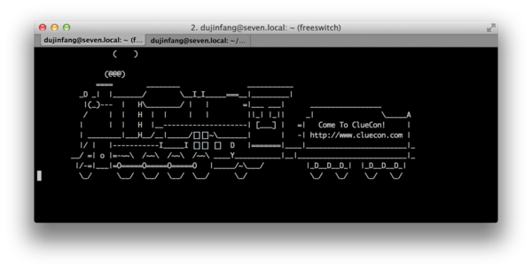

# 模块

FreeSWITCH的模块有很多，它们丰富了FreeSWITCH的功能。本章列出大部分已知的的模块，供广大读者参考。有的模块比较有代表性，我们也会详细介绍一下。

## 模块列表

关于模块的介绍，在官方的Wiki页面上大部分也都能查到。<https://freeswitch.org/confluence/display/FREESWITCH/Modules> ，大部分模块也都有自己的页面，它们的URL也比较规范，如<https://freeswitch.org/confluence/display/FREESWITCH/mod_dptools> 、<https://freeswitch.org/confluence/display/FREESWITCH/mod_commands> 等 。

我们基于FreeSWITCH 1.8版，以自然的顺序来讲解。这里，模块的顺序是用下面命令生成的：

    cd src/mod
    find . -type d -name mod_*

各个模块根据其主要功能和能提供的接口分到不同的目录中。

### applications

该目录下的模块提供了大部分的应用功能，有的模块实现了多种Interface不好归类也会存在该目录中。

* *`mod_abstraction`**：用于创建新的API命令。新的命令可以基于原有的API创建，相当于创建原有命令的别名或快捷方式。
* *`mod_av`**：基于libav.org库的视频模块。支持H263、H264编解码，mp4视频播放和录像，RTMP推送等。也支持`ffmpeg`库（`2.6、2.8、3.0`）。
* *`mod_avmd`**： avmd是Advanced Voice Mail Detection的缩写，即高级语音邮件检测。它是`mod_vmd`的高级版。详见`mod_vmd`。
* *`mod_bert`**：一个用于音频测试的模块。
* *`mod_blacklist`**： 黑名单功能。它提供了一些通过Dialplan来添加、删除以及检查黑名单的方法。
* *`mod_callcenter`**： 一个比较强大的呼叫中心类应用。
* *`mod_cidlookup`**： 用于主叫号码查询，即可以根据主叫号码从本地数据库或网络上查询到主叫的名字。网络上有开放的服务，如：

```
$ curl https://api.opencnam.com/v2/phone/16502530000?format=pbx
    GOOGLE INC
```

* *`mod_cluechoo`**： 该模块是一个例子模块，主要是教大家怎么写模块。另外，它还带了一个好玩的例子，如在命令行上执行cluechoo将会看到屏幕上开过一个小火车。
* *`mod_commands`**： 提供了系统大部分的命令API。
* *`mod_conference`**： 多人语音及视频会议。
* *`mod_curl`**： 使用`libcurl`作为一个HTTP客户端向Web服务器发送请求，也可以得到返回的结果。
* *`mod_cv`**：使用OpenCV库，对视频进行图像识别的模块。
* *`mod_db`**： 该模块提供一组接口，用于使用API或App对数据库表进行增、删、改、查。
* *`mod_directory`**： 该模块用于按姓名呼叫用户。如果不知道用户的分机号，但知道用户的名字，则可以通过输入该用户名字的前几位进行拨叫。如，在下面的例子中，我们可以通过拨打411进入directory程序。

```
<extension name="directory" continue="true">
    <condition field="destination_number" expression="^411$">
        <action application="directory" data="default $${domain} default"/>
    </condition>
</extension>
```

当系统提示输入名字时，我们输入`9378`可以找到Brian West（默认是按`last_name`查找的，West对应键盘按键`9378`）。

* *`mod_distributor`**： 如果需要通过多个网关出局时，该模块可以帮助将呼叫根据一定的比例分发到不同的网关。
* *`mod_dptools`**： 提供了系统大部分的App。
* *`mod_easyroute`**： 用于根据号码路由，对大规模的DID比较有用。
* *`mod_enum`**： 通过ENUM查询可以根据E164号码找到用户的SIP地址。该模块也提供一个enum Dialplan。
* *`mod_esf`**： ESF是Extended SIP Functionality的缩写，即扩展的SIP功能。它提供通过Muticast方法进行组拨的功能。
* *`mod_esl`**： 该模块用于两个FreeSWITCH间的ESL对接。即一个FreeSWITCH可以作为另一个FreeSWITCH的ESL客户端访问它。
* *`mod_expr`**： 提供`expr`表达式计算。
* *`mod_fifo`**： 一个先入先出队列（First In First Out），可以用于简单的呼叫中心排队。
* *`mod_fsk`**： 收发FSK（Frequency-shift keying，移频键控）信息。
* *`mod_fsv`**： FSV是FreeSWITCH Video的缩写，它使用了一种私有的格式来进行视频录像，可以支持任何编码的视频格式。它只存储原始的RTP包，对视频流不进行任何处理。
* *`mod_hash`**： 用于操作系统内部的哈希表。可以存储一些简单的数据。
* *`mod_httapi`**： 一种HTTP格式的API接口，可以通过HTTP方式写IVR。
* **mod\_http\_cache**： 通过http方式上传和下载文件，并可以进行本地缓存。
* *`mod_ladspa`**： 使用ladspa库对声音进行处理，可以让声音更好听。
* *`mod_lcr`**： LCR是Least Cost Routing的缩写，即最省钱的路由。它会根据数据库配置的路由信息和费率找到最省钱的路由。
* *`mod_limit`**： 用于系统资源限制。
* *`mod_memcache`**： 与Memcache交互，类似把`mod_hash`的数据库到远程的Memcache中。
* *`mod_mongo`**： 与Mongodb交互，类似`mod_memcache`。
* *`mod_mp4`**： 提供MP4文件的播放支持。
* *`mod_mp4v2`**： 提供MP4文件的录像支持。
* *`mod_nibblebill`**： 一些简单的计费功能，可用于预付费和电话卡类的应用。
* *`mod_oreka`**： 使用oreka进行录音。oreka是一款开源的录音软件。
* *`mod_osp`**： 通过Open Settlement Protocol查找路由或上报CDR。
* **mod\_rad\_auth**： 使用radius服务器进行鉴权。
* *`mod_random`**： 通过访问/dev/hwrandom设备影响随机数的熵。
* *`mod_redis`**： 与redis服务器交互，类似`mod_memcache`。
* *`mod_rss`**： 访问RSS（Really Simple Syndication，简易信息聚合）数据。
* *`mod_skel`**： 一个模块的例子框架。
* *`mod_sms`**： 处理文本消息。如收发SIP MESSAGE消息等。它实现了消息路由（Chazplan），类似Dialplan。
* *`mod_snapshot`**： 可以截取一段声音的快照。
* **mod\_snipe\_hunt**： 一个简单的例子模块。
* *`mod_snom`**： 用于snom话机的一些特性。
* *`mod_sonar`**： 该模块类似于一个真正的声纳。首先你可以在远端启动一个服务器，能对来话执行`echo` App。然后在本地的FreeSWITCH上产生一些铃音，发送到远端的服务器上再反射回来，然后使用VAD检测功能可以检测这些铃音，从而可以在某种程度上确定网络的质量。
* *`mod_soundtouch`**： 使用soundtouch库对声音进行处理，可以增加音效。
* *`mod_spandsp`**： 使用spandsp[^spandsp]支持一些语音编码及传真功能。

[^spandsp]: http://www.soft-switch.org/

* *`mod_spy`**： 用于监视某个话机，当该话机有通话时，本机就振铃并可以监听。
* *`mod_stress`**： 使用快速傅立叶变换（FFT，Fast Fourier Transform）检测重音。
* *`mod_translate`**： 通过既定的规则对号码进行翻译。
* **mod\_valet\_parking**： 电话停靠。类似于泊车，有来电时可以将来电依靠在某个泊位上，然后通知某人拨开指定的号码将来话『接』走。
* *`mod_vmd`**： 提供Voicemail声音检测。在国外，好多电话都有自动应答功能，如『您好，主人不在家，请留言』。使用该模块可检测到这种声音，应用程序在自动外呼时就可以根据它的结果判断是人工接听的还是机器接听的。

* *`mod_voicemail`**： 语音邮箱。
* **mod\_voicemail\_ivr**： 带IVR导航的语音邮箱。

### asr_tts

提供自动语音识别及语音合成的功能。

* *`mod_cepstral`**： 使用Cepstra语音库支持TTS。
* *`mod_flite`**： 使用Festival Lite库支持TTS。
* *`mod_pocketsphinx`**： 使用pocketsphinx库支持语音识别。
* ***mod\_tts\_commandline**： 通过命令行程序使用TTS。
* *`mod_unimrcp`**： 通过uniMRCP协议与其他ASR/TTS产品对接。uniMRCP是一个标准的协议，很多语音产品都支持它。

### codecs：

各种类型的音、视频编码。大多数名称都很直观，不再多做解释。

* *`mod_amr`**：AMR编解码，仅支持透传。
* *`mod_amrwb`**：AMR编解码，宽带，仅支持透传。
* *`mod_b64`**： Base64编码，可以传输任何数据。
* *`mod_bv`**： BroadVoice的编码。
* *`mod_celt`**：CELT编解码。
* *`mod_codec2`**：Codec2编解码，非常节省带宽，仅2-4k。
* **mod\_com\_g729**： 商业的G.729编码，可转码，需要许可证。
* **mod\_dahdi\_codec**： 通过DAHDI库提供的编码。
* **mod\_g723\_1**：G723编解码，仅支持透传。
* *`mod_g729`**：仅支持透传。
* *`mod_h26x`**：提供H261，H263，H264等视频编码，仅支持透传
* *`mod_ilbc`**：iLBC编解码。
* *`mod_isac`**：iSac编解码。
* *`mod_mp4v`**：mp4v编解码，仅支持透传。
* *`mod_openh264`**：使用思科OpenH264库支持H264编解码。
* *`mod_opus`**：OPUS编解码。
* **mod\_sangoma\_codec**：通过硬件板卡支持包括G729、iLBC等多种编码
* *`mod_silk`**：SILK编解码。
* *`mod_siren`**：Siren编解码。
* **mod\_skel\_codec**：例子模块。
* *`mod_speex`**：SpeeX编解码模块。在1.4版中已移至核心中，不再以独立模块的形式存在
* *`mod_theora`**：Theora编解码。
* *`mod_vp8`**：在1.6中已被`mod_vpx`代替。
* *`mod_vpx`**：VP8、VP9编解码模块。

### dialplans

拨号计划。

* **mod\_dialplan\_asterisk**：类似于Asterisk格式的拨号计划。
* **mod\_dialplan\_directory**：通过LDAP查询拨号计划。
* **mod\_dialplan\_xml**：XML拨号计划。

### directories

目录服务。

* *`mod_ldap`**：通过LDAP提供目录服务。

### endpoints

各种Endpoint的实现。

* *`mod_alsa`**： 使用ALSA声卡。
* *`mod_dingaling`**： 连接Google Talk。
* *`mod_gsmopen`**： 使用无线上网卡上的GSM接口或使用手机上的GSM接口与外界发短信或通话。
* *`mod_h323`**： 连接H.323设备。使用OpenH323库实现。
* *`mod_khomp`**： 使用KHOMP板卡。
* *`mod_loopback`**： 提供loopback回环接口。
* *`mod_opal`**： 连接H.323设备，使用OPAL库实现。
* *`mod_portaudio`**：通过Portaudio库支持本地声卡。
* *`mod_reference`**：未知。
* *`mod_rtmp`**： 通过Adobe的rtmp协议与浏览器中的Flash电话进行通话。
* *`mod_skinny`**： 支持思科的SCCP协议话机。
* *`mod_skypopen`**： 与Skype互通。
* *`mod_sofia`**： SIP模块。
* *`mod_unicall`**：未知。
* *`mod_verto`**：FreeSWITCH特定的基于WebSocket和JSON的协议，支持WebRTC。

### event_handlers

事件处理。

* *`mod_amqp`**：AMQP模块，支持与RabbitMQ连接，发送事件，执行命令等。
* **mod\_cdr\_csv**： CSV格式的话单。
* **mod\_cdr\_mongodb**： 将话单写入Mongodb。
* **mod\_cdr\_pg\_csv**： 将话单写入PostgreSQL数据库。
* **mod\_cdr\_sqlite**： 将话单写入SQLite数据库。
* **mod\_erlang\_event**：对接Erlang节点，提供事件、日志、命令接口等。
* **mod\_event\_multicast**：将事件通过组播方式发出去。
* **mod\_event\_socket**：通过ESL库与第三方的接口。
* **mod\_event\_test**：测试。
* **mod\_event\_zmq**：使用ZeroMQ协议与第三方对接。
* **mod\_format\_cdr**： JSON和XML格式的CDR。
* **mod\_json\_cdr**： JSON格式的CDR。
* *`mod_kazoo`**：2600Hz使用的Erlang模块，解决了`mod_erlang_event`的一些问题。
* **mod\_radius\_cdr**：将CDR写入Radius服务器。
* *`mod_rayo`**：Rayo支持。
* *`mod_smpp`**：使用SMPP协议发送即时消息。
* *`mod_snmp`**：SNMP网管接口。

### formats

格式。

* *`mod_imagick`**：使用ImageMagick库支持Gif、PDF等。
* **mod\_local\_stream**： 从本地文件生成媒体流。
* **mod\_native\_file**： 支持原生文件读写，如直接读写`.PCMU`或`.G729`格式的文件。
* *`mod_png`**：支持PNG文件。
* **mod\_portaudio\_stream**： 使用`portaudio`库从本地声卡生成媒体流。
* **mod\_shell\_stream**： 从Shell命令中生成媒体流。
* *`mod_shout`**： MP3文件格式支持，远程Shoutcast服务器支持。
* *`mod_sndfile`**： 使用`libsndfile`支持大多数的声音文件。
* *`mod_ssml`**： SSML格式的文件支持。
* **mod\_tone\_stream**： 生成铃流音。
* *`mod_vlc`**： 使用libvlc提供媒体文件格式的支持。
* *`mod_webm`**：支持webm文件。

### languages

各种嵌入式编码语言接口。

* *`mod_basic`**：Basic。
* *`mod_java`**： Java。
* *`mod_lua`**： Lua。
* *`mod_managed`**： 微软平台的语言接品，如C#、VB.NET等。
* *`mod_perl`**： Perl。
* *`mod_python`**：Python。
* *`mod_spidermonkey`**：Javascript，已被`mod_v8`替代。
* *`mod_v8`**：Javascript。
* *`mod_yaml`**：Yaml。

### loggers

日志。

* *`mod_console`**： 控制台日志。
* *`mod_graylog2`**： 使用graylog2写日志文件。
* *`mod_logfile`**： 日志文件。
* *`mod_syslog`**： 将日志写到Syslog。

### say

多语种接口。

* **mod\_say\_de**： 德语。
* **mod\_say\_en**： 英语。
* **mod\_say\_es**： 西班牙语。
* **mod\_say\_es_ar**： 西班牙语。
* **mod\_say\_fa**： 波斯语。
* **mod\_say\_fr**： 法语。
* **mod\_say\_he**： 希伯来语。
* **mod\_say\_hr**： 克罗地亚语。
* **mod\_say\_hu**： 匈牙利语。
* **mod\_say\_it**： 意大利语。
* **mod\_say\_ja**： 日语。
* **mod\_say\_nl**： 荷兰语。
* **mod\_say\_pl**： 波兰语。
* **mod\_say\_pt**： 葡萄牙语。
* **mod\_say\_ru**： 俄语。
* **mod\_say\_sv**： 萨尔瓦多语。
* **mod\_say\_th**： 泰语。
* **mod\_say\_zh**： 汉语。

### timers

定时器。

* **mod\_posix\_timer**：Posix定时器。
* *`mod_timerfd`**： 使用Linux内核中的`timerfd`定时器。

### xml_int

XML接口。

* **mod\_xml\_cdr**：使用XML格式写CDR。
* **mod\_xml\_curl**： 从远程HTTP服务器获取XML配置。
* **mod\_xml\_ldap**： 从远程LDAP服务器获取XML配置。
* **mod\_xml\_radius**： 从远程Radius服务器获取XML配置。
* **mod\_xml\_rpc**： 使用XMLRPC接口与第三方交互，提供命令、日志及事件接口等，本身也是一个简单的Web服务器，并提供一个简单的Web管理界面。
* **mod\_xml\_scgi**： 使用SCGI协议获取XML配置。

## `mod_sofia`
`mod_sofia`是FreeSWITCH中最重量级的模块，不管是代码量还是功能上都很丰富。关于该模块我们已经在《FreeSWITCH权威指南》上详细介绍过了，在此，我们仅来看一下Sofia Profile中的配置参数。

Sofia的Profile有很多参数，下面是一些简要说明，供参考。其中，有的选项是取布尔值的，则一般来说`true/yes`通用，`false/no`通用。

* **media-option**：媒体选项。该选项有两个取值。

    `resume-media-on-hold`：如果FreeSWITCH是没有媒体（No Media/Bypass Media）的，那么如果设置了该参数，当你在话机上按下hold键时，FreeSWITCH 将会回到有媒体的状态。如：

    `bypass-media-after-att-xfer`：Attended Transfer译即出席转移，也称协商转，它需要媒体才能完成工作。但如果在执行`att-xfer`之前没有媒体，该参数能让`att-xfer执行时有通过re-INVITE`请求要回媒体，等到转移结束后再回到Bypass Media状态。

* **user-agent-string**：该参数设置SIP消息中显示的User-Agent字段。如：

```
    <param name="user-agent-string" value="FreeSWITCH Rocks!"/>
```

* **debug**：设置是否启用调试。取值有0和1，如果是1则会输出更多的调试信息。如：

```
    <param name="debug" value="1"/>
```

* **shutdown-on-fail**：由于各种原因（如端口被占用，IP地址错误等），都可能造成 UA 在初始化时失败，该参数在失败时会停止FreeSWITCH。如：

```
    <param name="shutdown-on-fail" value="true"/>
```

* **sip-trace**：是否开启SIP消息跟踪。如：

```
    <param name="sip-trace" value="no"/>
```

另外，也可以在控制台上用以下命令开启和关闭SIP跟踪，如：

```
    sofia profile internal siptrace on
    sofia profile internal siptrace off
```

* **log-auth-failures**：是否将认证错误写入日志。

```
    <param name="log-auth-failures" value="true"/>
```

* **context**：设置来话到达Dialplan的Context，注意，如果用户鉴权通过，则用户目录中的`user_context`比该参数优先级要高。如：

```
    <param name="context" value="public"/>
```

* **rfc2833-pt**：设置SDP中RFC2833的Payload值。如：

```
    <param name="rfc2833-pt" value="101"/>
```

* **sip-port**：设置监听的SIP端口号。如：

```
    <param name="sip-port" value="5060"/>
```

* **ws-binding**：设置WebSocket的监听地址和端口号（用于SIP over WebSocket，一般是WebRTC呼叫）。如：

```
    <param name="ws-binding"  value=":5066"/>
```

* **wss-binding**：设置安全WebSocket监听地址和端口号。该选择需要相关的安全证书（`wss.pem`存放在`/usr/local/freeswitch/certs`目录下）。如：

```
    <param name="wss-binding" value=":7443"/>
```

* **dialplan**：设置Dialplan的类型。如：

```
    <param name="dialplan" value="XML"/>
```

* **dtmf-duration**：设置DTMF的时长。如：

```
    <param name="dtmf-duration" value="2000"/>
```

* **inbound-codec-prefs**：支持的来话语音编码，用于语音编码协商。如：

```
    <param name="inbound-codec-prefs" value="PCMU,PCMA,H264"/>
```

* **outbound-codec-prefs**：支持的去话语音编码。用于语音编码协商。如：

```
    <param name="outbound-codec-prefs" value="$${global_codec_prefs}"/>
```

* **rtp-timer-name**：RTP定时器名称，其他可先的定时器可以在FreeSWITCH中用『`show timers`』命令得到。

```
    <param name="rtp-timer-name" value="soft"/>
```

* **rtp-ip**：RTP使用的地址。如：

```
    <param name="rtp-ip" value="$${local_ip_v4}"/>
```

* **sip-ip**：SIP监听的IP地址。如：

```
    <param name="sip-ip" value="$${local_ip_v4}"/>
```

* **hold-music**：UA进入hold状态时默认播放的音乐。如：

```
    <param name="hold-music" value="$${hold_music}"/>
```

* **apply-nat-acl**：用于判断哪些IP地址涉及到NAT。如：

```
    <param name="apply-nat-acl" value="nat.auto"/>
```

* **extended-info-parsing**：是否启用扩展INFO解析支持，扩展INFO支持可用于向FreeSWITCH发送事件、API命令等。如：

```
    <param name="extended-info-parsing" value="true"/>
```

* **aggressive-nat-detection**：用于NAT穿越，检测SIP消息中的IP地址与实际的IP地址是否相符，详见9.4节。

```
    <param name="aggressive-nat-detection" value="true"/>
```

* **enable-100rel**：设置是否使用PRACK对SIP 183消息进行证实。如：

```
    <param name="enable-100rel" value="true"/>
```

* **enable-compact-headers**：是否压缩SIP头。压缩SIP头域能使用SIP包变小一些。如：

```
    <param name="enable-compact-headers" value="true"/>
```

* **enable-timer**：是否启用时钟。默认是启用的。启用时钟后，在指定的时间内（如20ms）如果收不到RTP数据，则返回静音（CNG）数据。如果不启用该功能，则会一直等待直到收到数据。如：

```
    <param name="enable-timer" value="true"/>
```

* **minimum-session-expires**：SIP会话超时最小值，在SIP消息中设置Min-SE。如：

```
    <param name="minimum-session-expires" value="120"/>
```

* **apply-inbound-acl**：对来话启用哪个ACL进行鉴权。如：

```
    <param name="apply-inbound-acl" value="domains"/>
```

* **local-network-acl**：默认情况下，FreeSWITCH会自动检测本地网络，并创建一条localnet.auto ACL规则。在NAT穿越时有用。也可以手工指定其它的ACL。如：

```
    <param name="local-network-acl" value="localnet.auto"/>
```

* **apply-register-acl**：对注册请求采用哪个ACL进行鉴权。如：

```
    <param name="apply-register-acl" value="domains"/>
```

* **dtmf-type**：DTMF收号的类型。有三种方式，info、inband、rfc2833。如：

    <param name="dtmf-type" value="info"/>


* **send-message-query-on-register**：如何发送`message-waiting`消息。`true`是每次都发送，而`first-only`只是首次注册时发送。如：

```
    <param name="send-message-query-on-register" value="true"/>
```

* **caller-id-type**：设置主叫号码显示的类型，`rpid`将会在SIP消息中设置`Remote-Party-ID`，而`pid`则会设置`P-*-Identity`，如果不需要这些，可以设置成`none`。如：

```
    <param name="caller-id-type" value="rpid"/>
```


* **record-path**：录音文件的默认存放路径。如：

```
    <param name="record-path" value="$${recordings_dir}"/>
```


* **record-template**：录音文件名模板。如：

```
    <param name="record-template"
    value="${caller_id_number}.${target_domain}.${strftime(%Y-%m-%d-%H-%M-%S)}.wav"/>
```

* **manage-presence**：是否支持列席（Presence）。如果不用的话可以关掉以节省资源。如：

```
    <param name="manage-presence" value="true"/>
```

* **manage-shared-appearance**：是否支持SLA（Shared Line Apperance）。如：

```
    <param name="manage-shared-appearance" value="true"/>
```

与此相关的还有两个参数，分别指定Presence的数据库名称及域，如：

```
    <param name="dbname" value="share_presence"/
    <param name="presence-hosts" value="$${domain}"/>
```

* **bitpacking**：设置G726的bitpacking。如：

```
    <param name="bitpacking" value="aal2"/>
```

* **max-proceeding**：最大的开放对话（SIP Dialog）数。如：

```
    <param name="max-proceeding" value="1000"/>
```

* **session-timeout**：会话超时时间。

```
    <param name="session-timeout" value="120"/>
```

* **multiple-registrations**：

是否支持多点注册，取值可以是`contact`或`true`。开启多点注册后多个UA可以用同一个分机注册上来，有人呼叫该分机时所有UA都会振铃。

```
    <param name="multiple-registrations" value="contact"/>
```

* **inbound-codec-negotiation**：SDP中的语音编协商，如果设成`greedy`，则自己提供的语音编码列表会有优先权。如：

```
    <param name="inbound-codec-negotiation" value="generous"/>
```

* **bind-params**：该参数设置的值会附加在Contact地址上。如：

```
    <param name="bind-params" value="transport=udp"/>
```

* **unregister-on-options-fail**：是否在Ping失败后取消分机注册。为了NAT穿越或支持Keep Alive，FreeSWITCH向通过NAT方式注册到它的分机（`nat-options-ping`）或所有注册到它的分机（`all-reg-options-ping`）周期性地发一些 OPTIONS包，相当于`ping`功能。如：

```
    <param name="unregister-on-options-fail" value="true"/>
    <param name="nat-options-ping" value="true"/>
    <!-- <param name="all-reg-options-ping" value="true"/> -->
```

* **tls**：是否支持 TLS，默认否。如：

```
    <param name="tls" value="true"/>
```

* **tls-bind-params**：设置TLS的其它绑定参数。如：

```
    <param name="tls-bind-params" value="transport=tls"/>
```

* **tls-sip-port**：TLS的监听端口号。如：

```
    <param name="tls-sip-port" value="5061"/>
```

* **tls-cert-dir**：存放TLS证书的目录。如：

```
    <param name="tls-cert-dir" value="$${internal_ssl_dir}"/>
```

* **sip_tls_versio**：使用的TLS版本，有`sslv23`（默认）或`tlsv1`两种。如：

```
    <param name="tls-version" value="sslv23"/>
```

* **rtp-autoflush-during-bridge**：该选项默认为 true。即在桥接电话是是否自动清空缓存中的媒体数据（如果套接字上已有数据时，它会忽略定时器睡眠，能有效减少延迟）。如：

```
    <param name="rtp-autoflush-during-bridge" value="false"/>
```

* **rtp-rewrite-timestamps**：是否重写或透传RTP时间戳。如果透传，FreeSWITCH有时会产生不连续的时间戳，有的设备对此可能比较敏感，该选项可以让FreeSWITCH产生自己的时间戳。如：

```
    <param name="rtp-rewrite-timestamps" value="true"/>
```

* **pass-rfc2833**：是否透传RFC2833 DTMF包。如：

```
    <param name="pass-rfc2833" value="true"/>
```

* **odbc-dsn**：使用ODBC数据库代替默认的SQLite。如：

```
    <param name="odbc-dsn" value="dsn:user:pass"/>
```

* **inbound-bypass-media**：将所有来电设置为媒体绕过模式，即媒体流（RTP）不经过FreeSWITCH。如：

```
    <param name="inbound-bypass-media" value="true"/>
```

* **inbound-proxy-media**：将所有来电设置为媒体透传。媒体经过FreeSWITCH但FreeSWITCH不处理，直接转发。如：

```
    <param name="inbound-proxy-media" value="true"/>
```

* **inbound-late-negotiation**：是否开启晚协商。默认情况下FreeSWITCH对来话会先协商媒体编码，然后再进入Dialplan。开启晚协商有助于在协商媒体编码之前，先前电话送到 Dialplan，因而在Dialplan中可以进行个性化的媒体协商。


```
    <param name="inbound-late-negotiation" value="true"/>
```

* **accept-blind-reg**：该选项允许任何电话注册，而不检查用户和密码及其他设置。如：

```
    <param name="accept-blind-reg" value="true"/>
```

* **accept-blind-auth**: 与上一条类似，该选项允许任何呼叫通过认证。如：

```
    <param name="accept-blind-auth" value="true"/>
```

* **suppress-cng**：抑制CNG，即不使用静音包。如：

```
    <param name="suppress-cng" value="true"/>
```

* **nonce-ttl**：设置SIP认证中nonce的生存时间（秒）。如：

```
   <param name="nonce-ttl" value="60"/>
```

* **disable-transcodin**：禁止转码，如果该项为true则在bridge其他电话时，只提供与a-leg兼容或相同的语音编码列表进行协商，以避免引起转码。

```
    <param name="disable-transcoding" value="true"/>
```

* **manual-redirect**：允许在Dialplan中进行人工重定向。如：

```
    <param name="manual-redirect" value="true"/>
```

* **disable-transfer**：禁止转移。如：

```

    <param name="disable-transfer" value="true"/>
```

* **disable-register**：禁止注册。如：

```
    <param name="disable-register" value="true"/>
```


* **NDLB-broken-auth-hash**：有一些电话对Chanllenge ACK的回复在哈希值里会有INVITE方法，该选项容忍这种行为。如：

```
    <param name="NDLB-broken-auth-hash" value="true"/>
```
    <!-- add a ;received="<ip>:<port>" to the contact when replying to register for nat handling -->

* **NDLB-received-in-nat-reg-contact**：为支持某些NAT穿越，在Contact头域中增加`;received="<ip>:<port>"`字符串。如：

```
    <param name="NDLB-received-in-nat-reg-contact" value="true"/>
```


* **auth-calls**：是否对来电进行鉴权。如：

```
    <param name="auth-calls" value="true"/>
```

* **inbound-reg-force-matching-username**：强制注册用户与SIP认证用户必须相同。如：

```
    <param name="inbound-reg-force-matching-username" value="true"/>
```

* **auth-all-packets**：对所有的SIP消息都进行鉴权，而不是仅仅是针对INVITE和REGISTER消息。如：

```
    <param name="auth-all-packets" value="false"/>
```

* **ext-rtp-ip**：在NAT环境中，设置外网RTP IP。该设置会影响SDP中的IP 地址。有以下几种可能：

```
- 一个IP 地址，如 12.34.56.78
- 一个 stun 服务器，它会使用 stun 协议获得公网 IP， 如 stun:stun.server.com
- 一个 DNS 名称，如 host:host.server.com
- auto ， 它会自动检测 IP 地址
- auto-nat，如果路由器支持NAT-PMP或uPnP，则可以使用这些协议获取公网IP。
```

如：

```
    <param name="ext-rtp-ip" value="auto-nat"/>
```

* **ext-sip-ip**：与上一条类似，设置外网的SIP IP。如：

```
    <param name="ext-sip-ip" value="auto-nat"/>
```

* **rtp-timeout-sec**：设置RTP超时值（秒）。指定的时间内RTP没有数据收到，则挂机。如：

```
    <param name="rtp-timeout-sec" value="300"/>
```

* **rtp-hold-timeout-sec**：RTP处于保持状态的最大时长（秒）。如：

```
    <param name="rtp-hold-timeout-sec" value="1800"/>
```

* **vad**：语音活动状态检测，有三种可能，可设为入（`in`）、出（`out`），或双向（`both`），通常来说`out`是一个比较好的选择。如：

```
    <param name="vad" value="out"/>
```

* **alias**：给Sip Profile设置别名。如：

```
    <param name="alias" value="sip:10.0.1.251:5555"/>
```

* **force-register-domain**：对所有用户都强制使用某一域（Domain）。如：

```
    <param name="force-register-domain" value="$${domain}"/>
```

* **force-subscription-domain**：对所有订阅都强制使用某一域（Domain）。如：

```
    <param name="force-subscription-domain" value="$${domain}"/>
```

* **force-register-db-domain**：对所有经过认证的用户都使用该域（Domain）存入数据库。如：

```
    <param name="force-register-db-domain" value="$${domain}"/>
```

* **force-subscription-expires**：强制一个比较短的订阅超时时间。如：

```
    <param name="force-subscription-expires" value="60"/>
```

* **enable-3pcc**：是否支持3PCC呼叫。该选项有两个值，`true`或`proxy`。 `true`则直接接受3PCC来电；如果选`Proxy`，则会一直等待电话应答后才回送接受。

```
    <param name="enable-3pcc" value="true"/>
```

* **NDLB-force-rport**：在NAT时强制rport。除非你很了解该参数，否则后果自负。如：

```
    <param name="NDLB-force-rport" value="true"/>
```

* **challenge-realm**：设置 SIP Challenge使用的`realm`字段是从哪个域获取，`auto_from`和`auto_to`分别是从From和To中获取，除了这两者，也可以是任意的字符串值，如：

```
    <param name="challenge-realm" value="freeswitch.org.cn"/>
```

* **disable-rtp-auto-adjust**：大多数情况下，为了更好的穿越NAT，FreeSWITCH 会自动调整（适应）RTP包的来源IP地址，但在某些情况下（尤其是在`mod_dingaling`中会有多个候选IP的时候），FreeSWITCH 可能会改变本来正确的IP地址。该参数禁用此功能。

```
    <param name="disable-rtp-auto-adjust" value="true"/>
```

* **inbound-use-callid-as-uuid**：在 FreeSWITCH 是，每一个Channel都有一个UUID， 该UUID是由系统生成的全局唯一的。对于来话，你可以使用SIP中的Call-ID字段来做UUID， 在某些情况下对于信令的跟踪分析比较有用。

```
    <param name="inbound-use-callid-as-uuid" value="true"/>
```

* **outbound-use-uuid-as-callid**：与上一个参数差不多，只是在去话时可以使用UUID作为Call-ID。

```
    <param name="outbound-use-uuid-as-callid" value="true"/>
```

* **rtp-autofix-timing**：在某些情况下自动修复RTP时间戳。

```
    <param name="rtp-autofix-timing" value="false"/>
```

* **pass-callee-id**：在支持的话机或系统间传送相关消息以更新被叫号码（在多个FreeSWITCH实例间使用`X-FS-Display-Name`和`X-FS-Display-Number`SIP头域实现）。可以设置是否支持这种功能。如：

```
    <param name="pass-callee-id" value="false"/>
```

* **auto-rtp-bugs**：在跟某些不符合标准设备对接时，为了最大限度的支持这些设备，FreeSWITCH在这方面进行了妥协。可能的取值有`CISCO_SKIP_MARK_BIT_2833`和`SONUS_SEND_INVALID_TIMESTAMP_2833`等。使用该参数时要小心。如：

    <param name="auto-rtp-bugs" data="SONUS_SEND_INVALID_TIMESTAMP_2833"/>

* **disable-srv**或**disable-naptr**：这两个参数可以规避DNS中某些错误的 SRV 或 NAPTR 记录。如：

    <param name="disable-srv" value="true" />
    <param name="disable-naptr" value="true" />


最后要讲的这几个参数允许根据需要调整Sofia-SIP库中底层的时钟，一般情况下不需要改动。这几个参数是给高级用户用的，一般来说保持使用默认值即可。更详细的说明请参考FreeSWITCH默认的配置文件中的说明及相关的RFC3261。这些参数和默认值如下：

    <param name="timer-T1" value="500" />
    <param name="timer-T1X64" value="32000" />
    <param name="timer-T2" value="4000" />
    <param name="timer-T4" value="4000" />

## `mod_dptools`

`mod_dptools`这应该是FreeSWITCH中最常用的模块了。

本模块实现了系统大部分的Application（即我们常说的App）。dptools是Dialplan Tools的简写。也就是说，这些App大部分是在Dialplan中用的。

我们可以通过在FreeSWITCH中重新加载该模块来查看一些信息，如：

     freeswitch> reload`mod_dptools`
     ...
     Adding Application 'blind_transfer_ack'
     Adding Application 'bind_digit_action'
     Adding Application 'capture'
     Adding Application 'clear_digit_action'
     Adding Application 'digit_action_set_realm'
     Adding Application 'privacy'
     Adding Application 'set_audio_level'
     Adding Application 'set_mute'
     …

从上面的例子可以看出，里面实现了很多我们不熟悉的App。关于这些App，我想，等所有模块都讲完了后我们也可以一个一个的讲。

关于App，我们前面讲过了，最常见的如`answer`、`echo`、`bridge`等，它们都是执行一些功能跟通话的另一端进行交互。还记得吗？我们以前说过，跟FreeSWITCH通信其实就是在跟FreeSWITCH中的一个App在通信。

除App外，该模块还实现了一些Endpoint、Dialplan、API、File、Chat等Interface。

其中，有一个我们最熟悉的Endpoint——user，是的，可能大家都天天在使用，但没有注意到它是一个Endpoint。实际上，它相当于一个虚拟的Endpoint，我们先看一下下面的例子：

     <action application="bridge" data="user/1000"/>

这里，`user/1000`是一个呼叫字符串，而user就是个Endpoint，实际上，它（在默认的配置下）相当于如下的字符串：

     <action application="bridge" data="sofia/internal/1000@192.168.x.x"/>

其中，`192.168.x.x`是一个IP（实际上它是一个Domain，参见第\ref{domainux7b80ux4ecb}节）。所以，这里的sofia才是真正的endpoint，而user只是相当于到sofia的一个快捷方式而已。

别的不说了，将该模块多reload几遍相信你在日志中就有更多的发现。然后，有时间可以看看源代码啊，很好懂的。

## `mod_commands`

接下来，我们来看一`mod_commands`模块。该模块实现了系统大多数的API命令，如 `version`、`status`以及我们常用的`originate`等。

类似于上一节，我们可以通过`reload`模块的方式查看模块的一些信息，不妨输入下列命令试试：

    freeswitch> reload`mod_commands`

    +OK Reloading XML

    -ERR unloading module [Module is not unloadable]

我们看到，该命令无情地抛出了一个错误，说该模块是无法被卸载的，自然，就无法重新加载了。看来，我们昨天学到的技术不好用了。我们只得另想办法。

我们知道`fs_cli`可以做为一个客户端连接到FreeSWITCH上，看日志，执行命令什么的。其实，它也有一个小的技巧，就是，用`-x`参数执行一个命令立即即出，如：

    $ fs_cli -x "status"

    UP 0 years, 0 days, 13 hours, 46 minutes, 47 seconds, 330 milliseconds, 78 microseconds
    FreeSWITCH (Version 1.5.8b git 0c8d8ba 2014-01-16 01:06:11Z 64bit) is ready
    6 session(s) since startup
    0 session(s) - peak 1, last 5min 0
    0 session(s) per Sec out of max 200, peak 1, last 5min 0
    3000 session(s) max
    min idle cpu 0.00/100.00
    Current Stack Size/Max 240K/8192K

哇，既然能这样用就好办了。我们可以用下面的命令看一看`mod_commands`模块中都实现了哪些API命令：

    $ fs_cli -x "help" | grep`mod_commands`
    ...,,Shutdown`mod_commands`
    acl,<ip> <list_name>,Compare an ip to an acl list`mod_commands`
    alias,[add|stickyadd] <alias> <command> | del [<alias>|*],Alias`mod_commands`
    banner,,Return the system banner`mod_commands`
    bg_system,<command>,Execute a system command in the background`mod_commands`
    bgapi,<command>[ <arg>],Execute an api command in a thread`mod_commands`
    … 此处省略XXXX字

其实，这里的`help`命令也是在`mod_commands`里实现的，同样，`load`/`unload`/`reload`也都是，这也是为什么该模块不能卸载的根本原因——`unload`依赖`mod_commands`，所以，它不能卸载自己所在的模块。

当然，另外一个方法就是到Wiki上找文档了。该模块的文档还是挺全的。见：<https://freeswitch.org/confluence/display/FREESWITCH`mod_commands`> 。

通过这两节你应该会注意到一些小技巧：如通过`reload`一个模块查看某模块中实现了哪些Interface这种技巧。如果想好好学习的话一定要注意发现。以后，我们就不详细详解这些技巧的细节了。

## `mod_portaudio`

与`mod_sofia`模块类似，`mod_portaudio`也是一个Endpoint模块。与`mod_sofia`不同的是，`mod_sofia`实现了SIP，而`mod_portaudio`实现了驱动本地声卡，即，它可以从本地麦克风获取输入，并将声音从耳机/扬声器中播放出来。因而，配合`mod_sofia`，可以用作一个软电话。

该模块默认是不编译的。到你的源代码树下，执行如下命令编译安装：

    make`mod_portaudio`
    make`mod_portaudio`-install

然后到控制台中，执行:

    freeswitch> load`mod_portaudio`

如果得到『Cannot find an input device』之类的错误可能是你的声卡驱动有问题。如果是提示『+OK』就是成功了，接着执行：

    freeswitch> pa devlist

    API CALL [pa(devlist)] output:
    0;Built-in Microphone;2;0;
    1;Built-in Speaker;0;2;r
    2;Built-in Headphone;0;2;
    3;Logitech USB Headset;0;2;o
    4;Logitech USB Headset;1;0;i

以上是在笔者Mac笔记本上的输出，它列出了所有的声音设备。其中，3和4最后的『o』和『i』分别代表声音输出(out)和输入(in)设备。在你的电脑上可能不一样，如果你想选择其他设备，可以使用命令：

    freeswitch> pa indev #0
    freeswitch> pa outdev #2

以上命令会选择我电脑上内置的麦克风和耳机。

接下来你就可以有一个可以用命令行控制的软电话了，酷吧？

    freeswitch> pa looptest    (回路测试，echo)
    freeswitch> pa call 9999
    freeswitch> pa call 1000
    freeswitch> pa hangup

如上所示，你可以呼叫刚才试过的所有号码。现在假设想从SIP分机1000呼叫到你，那需要修改拨号计划(Dialplan)。用你喜欢的编辑器编辑以下文件放到`conf/dialplan/default/portaudio.xml`中：

    <include>
      <extension name="call me">
        <condition field="destination_number" expression="^(me|12345678)$">
          <action application="bridge" data="portaudio"/>
        </condition>
      </extension>
    </include>

然后，在控制台中按『F6』或输入以下命令使之生效：

    FS> reloadxml

在分机1000上呼叫『me』或『12345678』(你肯定想为自己选择一个更酷的号码)，然后在控制台上应该能看到类似『`[DEBUG]`mod_portaudio`.c:268 BRRRRING! BRRRRING! call 1`』的输出（如果看不到的话按『F8』能得到详细的Log），这说明你的软电话在振铃。多打几个回车，然后输入『`pa answer`』就可以接听电话了。『`pa hangup`』可以挂断电话。

当然，你肯定希望在振铃时能听到真正的振铃音而不是看什么BRRRRRING。好办，选择一个好听一点的声音文件(`.wav`格式)，编辑conf/autoload_configs/portaudio.conf.xml，修改下面一行：

    <param name="ring-file" value="/home/your_name/your_ring_file.wav"/>

然后重新加载模块：

    freeswitch> reloadxml
    freeswitch> reload`mod_portaudio`

再打打试试，看是否能听到振铃音了？

如果你用不惯字符界面，可以看一下FreeSWITCH-Air[^FreeSWITCH-Air]，它为 FreeSWITCH 提供一个简洁的软电话的图形界面。另外，如果你需要高清通话，除需要设置相关的语音编解码器(codec)外，你还需要有一幅好的耳机才能达到最好的效果。笔者使用的是一款USB耳机。

[^FreeSWITCH-Air]: <https://wiki.freeswitch.org/wiki/FsAir> 。

另外两款基于FreeSWITCH的软电话是 [FSComm](https://freeswitch.org/confluence/display/FREESWITCH/FSComm)（QT实现） 和 [FSClient](https://freeswitch.org/confluence/display/FREESWITCH/FSClient)（C#实现）。

## `mod_rtmp`

`mod_rtmp`是另外一个Endpoint。它实现了RTMP协议。RTMP协议是Adobe Flash中使用的协议。

通过使用Flash，便可以在浏览器中使用Flash版软电话了，用户再也不需要下载一个SIP客户端，这对于互联网应用来说是非常有吸引力的。

虽然近几年兴起的WebRTC着实另人激动，但由于顽固的IE至今不支持WebRTC，因而，Flash还是比较有效的解决方案。在此之前，大家一般是使用ActiveX控件的方式在IE浏览器中支持SIP客户端。

该模块的安装很简单，直接在FreeSWITCH源码目录中使用`make`mod_rtmp`-install`安装即可。

在源码目录的`client`目录下也包含了Flex软电话的源码和例子。该客户端也提供相关的Javascript API以便在网页上对其进行控制。

该模块也支持注册，它也是使用FreeSWITCH的XML Directory进行用户认证。因此，可以在Javascript中使用类似下面的代码注册：

    flash.login('1000@192.168.1.2', '1234')

Flash注册后，就可以在FreeSWITCH中使用下列命令查看注册用户的情况：

    rtmp status profile default reg

是不是看起来跟Sofia命令很像啊。

它也可以使用如下的API外呼：

    flash.makeCall(number, account, options);

当然，它也可以做被叫，找到被叫的地址是靠`rtmp_contact` API实现的，如

    rtmp_contact(user@domain)

详细情况参见 <https://freeswitch.org/confluence/display/FREESWITCH`mod_rtmp`> 。也可以参考第\ref{flash}节的相关内容。

## `mod_skypeopen`
`mod_skypeopen`是一个有意思的模块，它提供FreeSWITCH与Skype的互通。

Skype是世界上广泛使用的VoIP软件，不过，在被微软收购后表现不怎么样，最近又传出Skype将停止提供第三方API接口，也就是说FreeSWITCH将无法与新版的Skype互通。

不过，旧版的Skype好像不受影响，而且，不管以后FreeSWITCH是否能与Skype互通，`mod_skypopen`对我们都有借鉴意义。

`mod_skypopen`的前身是`mod_skypiax`，后来才改为此名。该模块实现的很有意思。Skype不是提供API吗？也就是说它允许外部的程序通过一定的API控制Skype（相当于通信信令）。所以，理论上讲，就可以将控制Skype的部分代码放到FreeSWITCH中，而仍然需要启动一个Skype实例登录到实际的Skype网络中与其它Skype进行通信。在Linux中，通过使用内核中的虚拟声卡，可以指定不同的Skype实例使用不同的虚拟声卡，而在FreeSWITCH中通过访问这些虚拟声卡读写音频数据（相当于媒体流），进而完成信令和媒体的交互。

最初的Skype一个Skype账号在一台主机上只允许登录一次，所以我们最初使用时，注册了20个Skype账号，在一台Linux服务器上启动了20个Skype实例，并分别用不同的账号注册上去。对于FreeSWITCH而言，这20个实例就相当于20条外线，我们的SIP账号就可以通过这20条『Skype』外线打电话到其它的Skype账号上。

有什么用呢？当初我们在做在线一对一英语口语教学时，美国的老师使用SIP客户端，而学员一般使用手机（SIP客户端在我国不怎么稳定）与老师对话。但问题是，有的学员手机信号不好，有的呢，千里迢迢漫游到北京去上学习班（但却买我们的网络口语教学课程），无法支付高昂的漫游费。而使用Skype就解决了这一问题。

后来，Skype允许在一台主机上用同一账号多次登录，所以，我们就用同一个Skype账号登录20个Skype实例，实现了类似模块中继线的功能——打出去对外显示一个号。

当然，该模块是跨平台的，在Windows上也可以使用，也支持多账号。当前闲着没事的时候，笔者也实现了在Mac上的支持，只不过后来没有继续开发，也从来没有合并到主分支里去。

`mod_skype`也是一个Endpoint。

它的详细安装和使用方法参见：<https://freeswitch.org/confluence/display/FREESWITCH`mod_skypopen`> 。

## `mod_cdr_csv`

`mod_cdr_csv`是FreeSWITCH中写话单的模块。该模块会以CSV（Comma-Separated Values，即以逗号分隔的值）格式写话单，当然，其它也可以通过配置模板选择将话单写成任何格式。

话单文件的默认存储位置是在`/usr/local/freeswitch/log/cdr-csv`目录下，当话单文件增长到一定程度，便会发生轮转（rotate），即，关闭原来的话单文件，重新生成新的话单文件。旧的话单文件会以日期时间的文件名格式保存，如：

    1003.csv.2014-01-24-19-22-57

当然，如果话单文件还没有增长到一定程序时，也可以手工触发话单`rotate`，如在FreeSWITCH控制台上执行如下命令：

    freeswitch> cdr_csv rotate

该模块本身没有什么值得多说的，下面说一下话单文件的处理。其实我想说的也不是如何处理话单，而是如何及时有效地处理话单。

笔者以前处理话单一直使用一个叫`iwatch`的工具，该工具是一个perl写的工具，通过配置正确的XML文件，可以让`iwatch`监听一个目录，`iwatch`使用Linux文件系统的的`inotify`机制监视文件系统，一旦文件系统发生变化，便可以执行相应的脚本。

但是，该工具在CentOS上装起来特别麻烦，而且，它又依赖于无数的Perl模块，因此，对于一些上网不方便的环境部署起来特别麻烦。后来，又找到一个C语言写的工具：<https://github.com/rvoicilas/inotify-tools/wiki> ，该工具看起来也不错，装起来也简单。安装后，我写了如下的脚本：

    #!/bin/sh

    CURPATH=`pwd`
    FSPATH=/usr/local/freeswitch/log/cdr-csv

    inotifywait -mr --timefmt '%d/%m/%y %H:%M' --format '%T %w %f' -e close_write $FSPATH | while read date time dir file
    do
           FILECHANGE=${dir}${file}
           # convert absolute path to relative
           FILECHANGEREL=`echo "$FILECHANGE" | sed 's_'$CURPATH'/__'`

           echo "At ${time} on ${date}, file $FILECHANGE was backed up to ..."
           echo mv $FILECHANGE /tmp/
    done


当然，该脚本仅仅是个简单的例子，它使用了`inotifywait`监视一个目录（即`/usr/local/freeswitch/log/cdr-dsv`），当该目录中发生了`close_write`事件（即当文件被以写入方式打开又关闭时）时，即话单写完了，我们可以执行一个命令把它移动（或复制）到其它的目录中去。当然，没有人阻止你修改该脚本，解析CDR再写入数据库之类的。

总之，笔者认为这是很简单而又灵活的实现方式。UNIX的哲学就是KISS嘛——Keep It Simple, Stupid。

## `mod_cluechoo`

`mod_cluechoo`这个模块是个很好玩的模块。很多人对此很好奇，不知道它有什么用。实际上，它真没什么用。用当比较流行的一句网络流行语说就是：『然而它并没有什么卵用』。

从名字看，不知道该模块是干什么的，而Wiki上对它的介绍也就只有一句话：`mod_cluechoo` implements Toyoda Masashi's famous Steam Locomotive (SL) command for FreeSWITCH。即，该模块在FreeSWITCH中实现了Toyoda Masashi的蒸汽机车命令。那么，该蒸汽机车又到底是什么东东呢？

说来话长，通过搜索引擎，我们找到了这个页面： <http://www.tkl.iis.u-tokyo.ac.jp/~toyoda/index_e.html> 。在UNIX系统上有一个`ls`命令，但有时候容易输错，成了`sl`，便会提示命令错误。而该蒸汽机车实现了一个`sl`命令，即蒸汽机车（Steam Locomotive）的英文缩写。实际上，该程序只是一个小小的玩笑，没什么实际用处。 该程序手册上对SL的介绍是这样的：SL (Steam Locomotive) runs across your terminal when you type "sl" as you meant to type "ls". It's just a joke command, and **not usefull at all**. Put the binary to /usr/local/bin.

那么，不管有用没用，在FreeSWITCH中怎么玩呢？

该模块是默认编译和加载的，在FreeSWITCH控制台上重新加载一下该模块，便可以从日志中看出一些信息：

    freeswitch> reload`mod_cluechoo`

    [CONSOLE] switch_loadable_module.c:1464 Successfully Loaded `mod_cluechoo`]
    [NOTICE] switch_loadable_module.c:269 Adding Application 'cluechoo'
    [NOTICE] switch_loadable_module.c:315 Adding API Function 'cluechoo'

从上面的日志中可以看出，该模块实现了一个cluechoo App，以及一个cluechoo API。如果对App和API是什么东东不了解的同学可以参考第\ref{apiux4e0eapp}节。。

接着在命令控制台上输入以下命令，便会看到一辆小火车开过，如图\ref{fig:cluechoo}：

     freeswitch> cluechoo



那么App怎么使用呢？构造如下的Dialplan，拨打cluechoo试一试。

    <extension name="cluechoo">
        <condition field="destination_number" expression="^cluechoo$">
            <action application="answer" data=""/>
            <action application="cluechoo" data=""/>
        </condition>
    </extension>

有兴趣的同学也要以看一看其源代码实现，挺有趣的哟 :) 。

## `mod_speex`

Speex[^speex]是一种音频编码格式，并专门针对语音进行优化。它支持窄带（8KHz）及宽带（16kHz）的编码，支持可变比特率（VBR）以及丢包补偿等，因此非常适合VoIP应用。而且，由于其采用BSD许可证，而且宣称没有任何专利问题，因而得到了广泛的使用。比方在RTMP中就使用speex编码。

[^speex]: 参见：<http://en.wikipedia.org/wiki/Speex> 。

最初，FreeSWITCH对speex编码的支持是在`mod_speex`中实现的，但是，在2014年2月份它被移到核心中去了[^move-speex-to-core]，代码提交说明是『move speex codec into the core since it already has speed anyway』。原因就是在FreeSWITCH的核心中已经加载了Speex代码库（用于resample，即抽样频率转换），`mod_speex`的功能就无需要再存在于外部模块中了。

[^move-speex-to-core]: 参见：<http://fisheye.freeswitch.org/changelog/freeswitch.git?cs=ab56c276a0881f8db37e71d4f23d7fd682433ab0> 。

把该模块移到核心意味着它总是可用的，并不能选择被卸载。但是，该模块很小，如果不用，也占不了多少资源。

## `mod_sonar`

Sonar译为声纳，又译声呐，其英文全称为『Sound Navigation And Ranging』，是一种利用声波在水下的传播特性，通过电声转换和信息处理，完成水下探测和通讯任务的电子设备。它有主动式和被动式两种类型，属于声学定位的范畴。 声纳系统的音频从次声波到超音波都有。

`mod_sonar`类似于一个真正的声纳。它的工作原理是这样的——首先你在远端启动一个服务器，能将收到的来话信息中的音频原样返回（可以使用FreeSWITCH中的`echo` App实现）。然后在本地的FreeSWITCH上产生一些铃音，发送到远端的服务器上再反射回来，然后使用VAD检测功能可以检测这些铃音，从而可以在某种程度上确定网络的质量。

加载该模块后，将会在日志中看到如下的消息：

    [NOTICE] switch_loadable_module.c:269 Adding Application ‘sonar'

可见，该模块只实现了一个`sonar` App。

为进行测试，我在一台远端的FreeSWITCH服务器上使用如下Dialplan做了一个Echo服务：

    <extension name=“public_dialplan_echo">
      <condition field="destination_number" expression="^(echo)$">
        <action application="answer"/>
        <action application="echo"/>
      </condition>
    </extension>

然后，在笔者的电脑上使用如下的命令进行测试（其中`x.x.x.x`为笔者的远端服务器的IP地址）：

    originate sofia/internal/echo@x.x.x.x:5080 &sonar

日志输出如下：

    [DEBUG] switch_ivr_async.c:3087 TONE ping HIT 1/1
    [DEBUG] switch_ivr_async.c:3093 TONE ping DETECTED
    [NOTICE]`mod_sonar`.c:87 Sonar ping took 379 milliseconds
    [NOTICE]`mod_sonar`.c:87 Sonar ping took 140 milliseconds
    [NOTICE]`mod_sonar`.c:87 Sonar ping took 380 milliseconds
    ...
    [INFO]`mod_sonar`.c:179 Sonar Ping (in ms):
           min:140 max:380 avg:303 sdev:103 mdev:83 sent:5 recv: 5 lost:0 lost/send:0.00%

从日志中可以看出，sonar这个App向远端发送了5次ping请求（实际上发送5次音频数据），然后收到（检测到）5次反射回来的音频，最小时长是140ms，最大是380ms，平均值是303ms，其它的值是均方差等。看起来还算不错。

当然，为了测试更准确一些，也可以给sonar一个参数，表示你想测试的次数，如，下列命令将测试10次：

    originate sofia/internal/echo@x.x.x.x:5080 &sonar(10)

下面是笔者用操作系统的ping命令得到的结果，可以看出，操作系统的ping包平均只需要28ms就能走一个来回。

    7 packets transmitted, 7 packets received, 0.0% packet loss
    round-trip min/avg/max/stddev = 16.233/28.495/80.739/21.465 ms

## `mod_rss`

RSS的全称是Really Simple Syndication，即简易信息聚合，它是一种消息模式规范。虽然，大部分博客都输出RSS格式的信息，便于RSS客户端阅读，但并不能说RSS只是订阅博客的，因为任何信息都可以输出到RSS。

该模块的功能是阅读本地的RSS文件。当然，这些RSS文件可以定期用外部程序甚至直接在Dialplan中通过Javascript或Lua等更新。

该模块默认是不安装的，到源代码目录中执行`make`mod_rss`-install`即可安装。

然后，下载一个RSS文件，如，可以下载笔者的博客提供的RSS：

    cd /tmp
    wget http://www.dujinfang.com/feed.xml

把`conf/autoload_configs/rss.conf.xml`改成如下的样子：

    <configuration name="rss.conf" description="RSS Parser">
      <feeds>
        <feed name="Seven's Blog">/tmp/feed.xml</feed>
      </feeds>
    </configuration>

然后，创建如下的Dialplan，拨打rss，它便能朗读RSS了。当然，为了让它能朗读中文，我使用了`mod_tts_commandline`模块（在FreeSWITCH权威指南上有详细介绍），并编写了一个脚本让它使用我的Mac上提供的TTS引擎进行朗读。

    <extension name="rss">
      <condition field="destination_number" expression="^rss$">
        <action application="answer" data=""/>
        <action application="rss" data="tts_commandline Ting-Ting"/>
      </condition>
    </extension>

在朗读过程中，还可以按0选择项目，按4听上一条，按6听下一条等。有兴趣的可以试一下，很有趣的。

## `mod_conference`

FreeSWITCH支持多人电话会议，该功能是由`mod_conference`模块实现的。

`mod_conference`是实现了一个`conference `App和API。在默认的配置中，直接拨打3000就可以进入一个会议。

从下列Dialplan可以看出，它使用`conference` App将来话送入一个会议：

    <extension name="nb_conferences">
        <condition field="destination_number" expression="^(30\d{2})$">
             <action application="answer"/>
             <action application="conference" data="$1-${domain_name}@default"/>
        </condition>
    </extension>

其中，`conference` App的参数是一个会议的名称和一个会议的Profile，它们之间是以`@`分隔的。`domain_name`一般是一个IP地址，所以，假设我们呼叫的是`3000`，FreeSWITCH的IP地址是`192.168.1.2`的话，将上述参数进行变量替换后，结果是：`3000-192.168.1.2@default`。

`@`前面的就是会议的名称，后面的`default`是会议的一个Profile。

会议的Profile定义了会议的一些特性，如各种提示音等。

为了简单起见，我们以`3000`作为会议的名称，修改Dialplan如下：

         <action application="conference" data=“3000@default"/>

这个，拨打3000就可以进入`3000`这个会议（室）。通过`conference` API命令，可以对会议执行一系列的操作，如下列命令将全部人员静音

    conference 3000 mute all

取消静音：

    conference 3000 unmute all

其中，会议中的每一路参与的电话称作一个成员（member），以`member_id`来标识，使用下列命令可以列出会议中所有的成员，进而知道成员的`member_id`：

    conference 3000 list

得到了成员的member_id后，便可以对成员进行单独操作，如以下命令仅对`member_id`为`2`的成员静音：

    conference 3000 mute 2

或将它踢出会议

    conference 3000 kick 2

当然，该命令的参数还有很多，具体的可输入不带参数的`conference`命令查看帮助。

    conference

除语音会议外，FreeSWITCH也支持视频会议。1.4版以前的FreeSWITCH不支持视频的转码，因而仅支持主持人式的视频会议。具体的讲，所有与会成员中会有一个成员会获得一个video floor，持有该floor的人的视频会广播到其它所有成员的终端上，即，所有成员都会看到该成员的视频。在默认情况下，floor的持有和转换是通过声音激励的方式实现的，即，通过一点的算法，根据当前声音的能量值来决定谁持有floor，一般来说是当前说话的成员持有该floor，即谁说话看谁。

自1.6版开始，FreeSWITCH支持视频转码和视频会议，我们以后再讲。

## `mod_enum`

说起`enum`，千万不要跟C语言里的枚举类型（`enum`）混了。ENUM是E.164 Number to URI Mapping的缩写，即E.164号码到URI的映射关系。如果说到这里你还不理解的话，想象一下域名到IP地址的映射关系吧。当你在Internet上访问一个域名（网址）时，如`www.freeeswitch.org.cn`，将先由DNS服务器将该域名翻译成一个IP地址，进而，你的注册品会访问该IP地址以获取它想要的网页内容。ENUM也是一样，它只不过是使用了类似DNS的技术，将一个E.164的电话号码（也就是我们常用的电话号码）映射为一个相应的VoIP地址（可以是SIP、H323或Jabber的地址），这样，我们就可以通过拨打一个普通的电话号码来访问一个VoIP地址。

提供这个号码映射关系的网站有e164.org和freenum.org等，有兴趣读者可以试一下。

如果读者比较仔细的话，可以看到在FreeSWITCH默认的Dialplan中有如下的设置：

    <extension name="enum">
      <condition field="${module_exists`mod_enum`)}" expression="true"/>
      <condition field="destination_number" expression="^(.*)$">
        <action application="transfer" data="$1 enum"/>
      </condition>
    </extension>

上述设置的意思是，如果以上所有Dialplan都没有相应的匹配规则的话，那么Dialplan的匹配将进入这里，该Extension将匹配所有被叫号码，并最终通过`transfer` App转入`enum` Dialplan进行进一步的路由查找

`enum` Dialplan会根据相应的配置查找相应的enum服务器查找是否有匹配的号码，如果能找到与被叫号码相匹配的项（无论是SIP地址还是其它VoIP地址），电话将进而桥接到相应的地址。

## `mod_spidermonkey`

SpiderMonkey是第一款最早面世的JavaScript引擎，它是Mozilla使用的Javascript引擎。FreeSWITCH也使用了该引擎来在FreeSWITCH内部支持Javascript嵌入式语言。

FreeSWITCH中对Javascript脚本的支持是在`mod_spidermonkey`中实现的。通过该模块，可以使用Javascrip控制呼叫流程，如，你可以使用如下Dialplan将电话交给一个Javascript脚本处理：

    <action application=“javascript” data=“/tmp/test.js”/>

然后，创建如下js文件：

    session.answer();
    session.sleep(1000);
    session.streamFile("/tmp/hello-js.wav");
    session.hangup();

在js脚本中，可以得到一个session对象（Object），然后就可以对该session进行操作了。一个session代表一路通话。从上面的js脚本中很容易看出，第一行用于对来话进行应答，第二行小睡一会（1000毫秒），第三行则播放一个`.wav`文件，第四行挂机。

是的，它等于以下Dialplan：

    <action application=“answer””/>
    <action application=“sleep” data=“1000”/>
    <action application=“playback” data=“/tmp/hello-js.wav”/>
    <action application=“hangup”/>

但是，大家都知道，在Dialplan中加入逻辑判断等功能都是有限的，但在Javascript中就不同了，你很容易写一些 if-else 之类的语句判断当前的场景进而执行不同的动作。关于这一点，我们在此就不举例子，有兴趣的可以自己研究一下。

除了SpiderMonkey外，另一个Javascript引擎是V8，这是一个在Google Chrome中以及 Node.js中使用的Javascript引擎，它提供了比SpiderMondey更好的性能。FreeSWITCH中也实现了一个`mod_v8`模块。该模块除了与`mod_spidermonkey`有一些小小的差别外，在API上完全兼容。也就是说，上述的test.js脚本在`mod_v8`下也能正常运行。

由于`mod_v8`的出现，现在`mod_spidermonkey`已经不推荐使用了，并被移到源代码库的`legacy`目录下。

## `mod_lua`和`mod_v8`

这两个模块都是在FreeSWITCH支持使用嵌入式语言来控制呼叫流程的。我们在以前的文章中也曾不同程度地提到他们。

其中`mod_lua`支持Lua语言，Lua是很有名的嵌入式语言，能非常好地嵌入其它语言的程序中。该模块有两个版本，最新的版本支持Lua 5.2，而支持Lua 5.1的版本现在已被移动到源代码的legacy目录中。

`mod_v8`支持Javascript，由Google的v8库提供支持，v8库已被成功用于Chrome及node.js中，性能强劲。其实对Javascript的支持也有两个版本，另一个版本也在legacy目录中，叫`mod_spidermonkey`。Spidermonkey是Firefox中的Javascript引擎。

Lua和Javascript两种语言有很多相似的地方，我们不必多说，先来看两个脚本：

**test.lua**

    session:answer()
    session:sleep(1000)
    session:streamFile("/tmp/hello-lua.wav")
    session:hangup()

**test.js**

    session.answer();
    session.sleep(1000);
    session.streamFile("/tmp/hello-js.wav");
    session.hangup();

可以看出，两个脚本的内容和功能基本上一样。第一行，对当前呼叫进行应答；然后，小睡一会（以确定能正确的建立媒体流）；接着，播放一个声音文件；最后，挂机。

可以分别使用如下Dialplan将来话路由到上述脚本：

    <action application=“lua” data=“/tmp/test.lua”/>

或

    <action application=“javascript” data=“/tmp/test.js”/>

当然，两个脚本本质上是Lua或Script，因而你可以很容易地在脚本中加入条件判断、循环等，甚至也可以通过相关的API与数据库或其它系统交互。能实现什么样的程序，完全靠你的想象力，从现在起，就写个脚本练一练吧？

## `mod_rtc`

`mod_rtc`是一个Endpoint模块，但它只处理媒体，不包含信令，因而，只能配合其它信令模块使用。在该提交信息里是这么说的：『add new stub module`mod_rtc` dummy signaling-free media engine endpoint 』。意思是，该模块是一个空的Endpoint模块，而且，该模块是跟信令无关的。

但是，它却可以独立运行。笔者测试了一下，编译安装后，加载该模块可以看到如下的输出：

    freeswitch> load`mod_rtc`
    [CONSOLE] switch_loadable_module.c:1466 Successfully Loaded `mod_rtc`]
    [NOTICE] switch_loadable_module.c:149 Adding Endpoint ‘rtc'

可以看出，它实现了一个名为`rtc`的Endpoint，我们可以使用如下的字符串试一下建立一个Channel：

    freeswitch> bgapi originate rtc/test &echo
    +OK Job-UUID: 0f41a0a2-63a5-4229-a8e0-c8e5281cce79

下列命令可以看出它确实建立了一个Channel：

    freeswitch> show channels

    uuid,direction,created,created_epoch,name,state, ...
    725369b7-0731-497f-9500-1e3c128b7626,outbound,2014-05-31 21:07:39,1401541659,N/A,CS_CONSUME_MEDIA,

当然，rtc/test 是我们按规则随便造的一个呼叫字符串，从现在的情况来看，它只是生成了一个Channel，现在还是什么都做不了。所以，我们也没什么可玩的，使用如下命令挂机：

    freeswitch> hupall

当然，实现该模块的代码还是很有意思的，它现在仅有短短的463行，对搞不懂`mod_sofia`的庞大又想学习写一个Endpoint模块的读者来说，是极好的学习材料。这次提交的哈希值是`5138f4d`，可以用如下命令查看：

    $ git show 5138f4d

其实，`mod_verto`就依赖该模块处理RTP媒体流，只是，用户不需要手工的调用，一般对终端用户而言是不可见的。但如果你是一位开发者，可以从源代码中一窥端倪。

我们将在下一节中讲`mod_verto`。

## `mod_verto`

上一节，我们讲了`mod_rtc`。`mod_rtc`是一个纯媒体的模块，目的是为了支持WebRTC。然而，任何的通信都需要一定的信令支持，`mod_verto`就是配合`mod_rtc`的信令模块。

众所周知，WebRTC从诞生的第一天起就只定义了媒体的交互和传输，而把信令留给大家自己实现，以便有更大的自由度。最初，大部分WebRTC的例子都是基于GAE的，但在电信的VoIP领域，SIP还是占统治地位的，因而，包括FreeSWITCH在内，又有一些SIP代理和软交换设备实现了配合WebRTC使用的SIP信令，这但是SIP over WebSocket。FreeSWITCH对SIP over WebSocket的支持是直接扩展了Sofia-SIP协议栈。

但无论如何，虽然SIP与传统的VoIP协议如H323相比，脱离了老式的电信信令思维，采用了类似HTTP协议的文本协议，但，它从电信领域诞生的基因决定了它还是很难融入互联网，退一步讲，人们还是认为SIP通信专业性太强了，SIP就是SIP，互联网就是互联网。

单从协议内容角度讲，SIP对于浏览器尤其是对于移动浏览器来说，还是有些庞大了。而基于文本的SIP协议解析起来对浏览器来说，即使不是一种负担，也不是非常的优雅。对浏览器来说，最适合的数据格式是JSON已是不争的事实。

我们很高兴地看到，FreeSWITCH团队开放了`mod_verto`。它采用了JSON及JSON-RPC相关的信令协议，非常优雅的与`mod_rtc`相配合，将热闹的互连网与冷冰冰的SIP通信结合在了一起。也就是说，FreeSWITCH不再是互联网从业者眼里专业的运动员，而跟MySQL，Apache一样，可以实实在在的融入互联网了。

在WebRTC设计之初，就非常重视安全问题，因而，一切都是加密的，不管是在媒体层还是在信令层，这是个好事，唯一比较麻烦的是，对于没有耐心的实践者来说，你在跑通`mod_verto`前要设置好你的Web服务器以及证书。

除了Endpoint功能外，`mod_verto`其实还自己带了一个HTTP/HTTPS服务器。这是一个隐藏选项，下面，我们看一下其配置：

    <vhosts>
        <vhost domain="localhost">
            <param name="alias" value="seven.local freeswitch.org"/>
            <param name="root" value="/usr/local/freeswitch/htdocs"/>
            <param name="script_root" value="/usr/local/freeswitch/scripts"/>
            <param name="index" value="index.html"/>
        <!--
            <param name="auth-realm" value="FreeSWITCH"/>
            <param name="auth-user" value="freeswitch"/>
            <param name="auth-pass" value="rocks"/>
        -->

        <rewrites>
            <rule expression="^/api" value="/my_custom_api.lua"/>
            <rule expression="^/channels" value="/rest.lua"/>
        </rewrites>
    </vhost>

在上述配置中，`alias`其实没什么用，备以后扩展；`root`要指向Web服务的根目录；`index`是默认的首页；`auth-`相关的是HTTP Basic认证；`rewrites`会重写请求地址，比如把请求重定向到一个Lua脚本进行处理（类似传统的CGI)。

把上述配置加到Verto的Profile部分，就可以有一个内置的小型的HTTP服务器了。

下面的Lua脚本可以提供REST风格的API，读者请参考 <https://freeswitch.org/confluence/display/FREESWITCH/Restful> 自行解析：

```lua
    --[[
    Restful by Seven Du.

    GET    /channels
    GET    /channels/uuid
    POST   /channels
    PUT    /channels/uuid
    DELETE /channels/uuid
    DELETE /channels
    ]]

    function headers()
        stream:write("HTTP/1.0 200 OK\r\n")
        if (accept == "application/json") then
            stream:write("Content-Type: application/json\r\n")
        else
            stream:write("Content-Type: text/plain\r\n")
        end
        stream:write("\r\n")
    end

    -- print(env:serialize())

    api = freeswitch.API()
    method = env:getHeader("Request-Method")
    http_uri = env:getHeader("HTTP-Request-URI")
    http_query = env:getHeader("HTTP-QUERY")
    accept = env:getHeader("Accept")
    uuid = string.sub(http_uri, "11") -- remove /channels/ from uri
    freeswitch.consoleLog("ERR", "[" .. method .. "]\n")
    -- freeswitch.consoleLog("ERR", http_uri .. "\n")
    -- freeswitch.consoleLog("ERR", http_query .. "\n")

    if (method == "GET") then
        if not (uuid == "") then
            format = ""
            if accept == "application/json" then
                format = " json"
            end
            ret = api:execute("uuid_dump", uuid .. format)
        else
            format = ""
            if (accept == "application/json") then
                format = " as json"
            end
            ret = api:execute("show", "channels" .. format)
        end
    elseif (method == "POST") then
        dest = env:getHeader("destNumber")
        app = "echo"
        dialstr = "user/" .. dest .. " &" .. app
        print(dialstr)
        ret = api:execute("originate", dialstr)
    elseif method == "PUT" then
        if action == "nomedia" then
            cmd = "uuid_media"
            arg = uuid .. " off"
        elseif action == "media" then
            cmd = "uuid_media"
            arg = uuid .. " on"
        elseif action == "hold" then
            cmd = "uuid_hold"
            arg = "on " .. uuid
        elseif action == "media" then
            cmd = "uuid_media"
            arg = "off" .. uuid
        end
        ret = api:execute(cmd, arg)
    elseif method == "DELETE" then
        if not (uuid == "") then
            cmd = "uuid_kill"
            arg = uuid
        else
            cmd = "hupall"
            arg = ""
        end
        ret = api:execute(cmd, arg)
    end
    headers()
    stream:write(ret .. "\n")
```

使用Curl测试RESTfulAPI的例子如下：

    curl -0 localhost:8081/channels
    curl -0 -XPOST -d "destNumber=1000" localhost:8081/channels
    curl -0 localhost:8081/channels/1f0802b7-3568-4eb6-b372-182861b56d9b
    curl -0 -H "Accept: application/json" localhost:8081/channels/1f0802b7-3568-4eb6-b372-182861b56d9b
    curl -0 -XDELETE localhost:8081/channels

关于本模块更详细的信息，请参阅：<https://confluence.freeswitch.org/display/FREESWITCH`mod_verto`> 。

## `mod_xml_rpc`

其实除了`mod_verto`外，在FreeSWITCH中很早就有另一个模块可以提供HTTP Server功能，这就是`mod_xml_rpc`。

该模块是最早的HTTP Server功能，在FreeSWITCH Console上执行

    load`mod_xml`_rpc

可以看到类似如下输出：

   `mod_xml`_rpc.c:1242 Starting HTTP Port 8080, DocRoot [/usr/local/freeswitch/htdocs]

表明一个监听8080端口的HTTP Server已经准备好了。

该模块默认使用HTTP Basic验证，用户名和密码都在`xml_rpc.conf.xml`中配置。

用浏览器打开FreeSWITCH服务器的8080端口，输入密码，就进入了一个小型的网站。里面的功能不多，不过，FreeSWITCH自己带了一个小小的FreeSWITCH Portal，这一块在《FreeSWITCH权威指南》里写得很详细，我们就不多说了。

我们来看看它提供的API：

    $ curl --user freeswitch:works localhost:8080/api/status
    <h1>FreeSWITCH Status</h1>
    2015-06-30 18:42:49<br>
    UP 0 years, 1 day, 21 hours, 31 minutes, 33 seconds, 325 milliseconds, 220 microseconds<br>
    FreeSWITCH (Version 1.7.0 git 2a1195e 2015-06-26 19:51:40Z 64bit) is ready<br>
    2 session(s) since startup<br>
    0 session(s) - peak 1, last 5min 0 <br>
    0 session(s) per Sec out of max 30, peak 1, last 5min 0 <br>
    1000 session(s) max<br>
    min idle cpu 0.00/100.00<br>
    Current Stack Size/Max 240K/8192K

很熟悉吧，跟在Console上执行的结果基本一样。如果你熟悉Curl的话，你就明白以上命令向FreeSWITCH发了一个HTTP请求，并得到了结果。

其实我们完全可以执行更复杂的命令，如

     $ curl --user freeswitch:works localhost:8080/api/sofia?status
                          Name        Type                                           Data     State
     =================================================================================================
                   192.168.7.6       alias                                       internal     ALIASED
                      external     profile                 sip`mod_sofia`@192.168.7.6:5080     RUNNING (0)
     .....


甚至发起一个呼叫，如：

    curl --user freeswitch:works "localhost:8080/api/originate?user/1000%20%26echo"

其中，参数经过urlencode处理，经过FreeSWITCH urldecode以后的命令就相当于：

    originate usr/1000 &echo

当然，更强大的还在后台，因为，你可以调用Lua

    $ curl --user freeswitch:works "localhost:8080/api/lua?/tmp/test.lua"
    Hi, 欢迎交流FreeSWITCH-CN微信公众号

对应的Lua脚本内容如下：`/tmp/test.lua`

    stream:write("Hi, 欢迎交流FreeSWITCH-CN微信公众号\n")

有了Lua，就有了无限可能。比方，你可以POST一些参数：

    $ curl --user freeswitch:works -XPOST -d "a=1&b=2" "localhost:8080/api/lua?/tmp/test.lua"
    Hi, 欢迎交流FreeSWITCH-CN微信公众号, 我收到的参数是 a=1 b=2

对应的Lua脚本是：

    a = env:getHeader("a")
    b = env:getHeader("b")

    stream:write("Hi, 欢迎交流FreeSWITCH-CN微信公众号, 参数是 a=" .. a .. " b=" .. b .. "\n")

大家已经看到，FreeSWITCH会将收到的POST参数存到`env`变量里，`env`是一个标准的Event变量，可以用getHeader取到参数的值。如果想查看全部的`env`变量，可以在脚本中加入以下代码：

    stream:write(env:serialize());

你甚至可以POST XML，如：

    curl --user freeswitch:works -XPOST -d '<xml><a>100</a><b>200</b></xml>' -H "Content-Type: application/xml" "localhost:8080/api/lua?/tmp/test.lua"

如果你像上面一个使用了`stream:write`的话，你就知道怎么取得这段XML字符串了。

## `mod_basic`

FreeSWITCH支持使用Lua、Javascript、Perl、Java等嵌入式语言脚本来控制呼叫流程。也有人说，为什么不支持BASIC呢？毕竟，BASIC也是一门语言，而且，它足够简单。

在2014年愚人节那天，FreeSWITCH开发团队宣布FreeSWITCH开始支持BASIC。当然，这并不是一个玩笑，FreeSWITCH是认真的。

通过使用如下Diaplan，就可以在有电话呼入时执行一个BASIC脚本`hello.bas`。

    <extension name="basic">
      <condition field="destination_number" expression="^basic$">
        <action application="basic" data="/tmp/hello.bas"/>
      </condition>
    </extension>

在FreeSWITCH的源代码中也给出了一个示例脚本，内容如下：

    s$ = "hello "
    s$ = s$ + "world"

    FS_LOG "WARNING" s$ + "!"

    FS_EXECUTE "answer"
    FS_EXECUTE "sleep" "1000"
    FS_EXECUTE "playback" "misc/misc-cluecon_is_premier_conference.wav”

当然，因为它是BASIC嘛，所以，很容易理解，以上脚本就是在日志中输出`hello world`，并执行`answer`, `sleep`, `playback` 等App。

从该模块的源代码中，可以看出它提供了以下函数：

    mb_register_func(bi, "FS_EXECUTE", fun_execute);
    mb_register_func(bi, "FS_GETARG", fun_getarg);
    mb_register_func(bi, "FS_GETVAR", fun_getvar);
    mb_register_func(bi, "FS_SETVAR", fun_setvar);
    mb_register_func(bi, "FS_API", fun_api);
    mb_register_func(bi, "FS_LOG", fun_log);

对BASIC有兴趣的小伙伴们可以自己试一下，我们就不深入研究了。该模块的发布声明在这里：<http://freeswitch.org/node/480> 。

## `mod_openh264`

使用思科（Cisco）的OpenH264库提供编解码支持。参考<https://github.com/cisco/openh264/blob/master/RELEASES>。

H264编解码使用需要授权，所以使用起来有一些限制。思科提供了一种解决该问题的思路——如果使用思科提供的动态编码库（虽然OpenH264是开源的，但你只能使用其二进制版本），则如果需要交版税的话，思科会帮你交。所以你可以以某种形式分发思科的二进制编码库，而不需要交H264版税。

当前，FireFox以及Chrome都使用了OpenH264库，不过，Chrome可能使用的另外的授权方式。

## `mod_blacklist`

前几天有网友问黑名单怎么做，我说自己写个Lua脚本查数据库吧。后来又查了一下，FreeSWITCH竟然有一个`mod_blacklist`，这不就是黑名单嘛。

说实话我以前从来没注意过这个模块。遇到一个新模块怎么办呢？当然是查FreeSWITCH的Wiki。那如果Wiki上也没有呢？Wiki上一般都会有，如果没有的话，也不怕，下面，我就带大家在不看Wiki的情况下如何了解一个模块。

当然，这个模块比较简单。首先，这个模块默认是不编译的，要手动编译

    $ cd src/mod/applications`mod_blacklist`
    $ make install
然后，就可以在FreeSWITCH里加载模块了：

    freeswitch> load`mod_blacklist`

显示日志如下：

    2016-04-28 09:12:29.508192 [CONSOLE] switch_loadable_module.c:1538 Successfully Loaded `mod_blacklist`]
    2016-04-28 09:12:29.508192 [NOTICE] switch_loadable_module.c:338 Adding API Function 'blacklist'

从日志中可以看出，该模块好像仅实现了一个API： blacklist

直接输入这个命令试下

    freeswitch@seven.local> blacklist
    2016-04-28 16:53:23.913138 [ERR]`mod_blacklist`.c:182 Invalid usage

出错啦，继续试：

    freeswitch@seven.local> blacklist test

    -ERR: No such command: test (see 'blacklist help')

有门，继续：

    freeswitch@seven.local> blacklist help

    blacklist check <listname> <item>
    blacklist add <listname> <item>
    blacklist del <listname> <item>
    blacklist save <listname>
    blacklist reload
    blacklist help
    +OK

从命令行中看，它好像支持多个列表（listname），每个列表中都有相关的条目（`item`）。看配置文件，`blacklist.conf.xml`里有这么一行：

    <list name="example" filename="$${conf_dir}/blacklists/example.list"/>

创建 `/usr/local/freeswitch/conf/blacklists/example.list`

里面的内容怎么写呢？不知道，蒙一把，输入

    1000
    1001

就是把电话号码每个一行。至于蒙的对不对，实际上可以看源代码的。在源代码中，有一个`load_list()`函数，看样子是用于加载这个列表的，主要内容如下：

    while (fgets(buf, 1024, f)) {
        trim(buf);
        switch_core_hash_insert(bl->list, buf, (void *)SWITCH_TRUE);
    }

很明显，它加从文件中依次读取每一行，然后插入一个内容哈希表中。看样子我们蒙的还比较靠谱。

重新加载一下模块：

    freeswitch@seven.local> reload`mod_blacklist`

    2016-04-28 15:09:18.868148 [INFO]`mod_blacklist`.c:104 Loaded list [example]
    2016-04-28 15:09:18.868148 [CONSOLE] switch_loadable_module.c:1538 Successfully Loaded `mod_blacklist`]

哈哈，Loaded list [example] 显示名为 example 的列表已经加载了。试试检查（check）命令

    freeswitch@seven.local> blacklist check example 1000

    true
    freeswitch@seven.local> blacklist check example 1001

    true
    freeswitch@seven.local> blacklist check example 1002

    false
由于`1002`不在列表中，返回了`false`。

看看能不能手工加

    freeswitch@seven.local> blacklist add example 1002

    +OK

    2016-04-28 16:54:02.593169 [INFO]`mod_blacklist`.c:228 Added [1002] to list [example]
    freeswitch@seven.local> blacklist check example 1002

    true

这次是`true`了。试试`save`命令：

    freeswitch@seven.local> blacklist save example
    2016-04-28 16:54:17.973176 [INFO]`mod_blacklist`.c:280 Saving example to /usr/local/freeswitch/conf/blacklists/example.list

    +OK

    $ cat /usr/local/freeswitch/conf/blacklists/example.list

    1000
    1002
    1001

可以看到`1002`已经加到列表里了。但由于内部实现是哈希表，没有排序，因次并没有特定的次序。

好了，但在实际打电话时怎么用呢？

创建如下Dialplan，这个例子来自FreeSWITCH的Wiki

    <extension name="blacklist_check">
    <condition field="${blacklist(check example ${destination_number})}" expression="^true$">
    <action application="bridge" data="sofia/external/sip:lenny@sip.itslenny.com:5060"/>
    </condition>
    </extension>

上面的意思是说，测试条件是一个动态条件，该动态条件是由`blacklist check listname item`完成的。上面的例子测试了被叫号码（`destination_number`）是否在黑名单，若否则继续呼。

我们再来个稍复杂点的例子：

    <extension name="echo">
        <condition field="destination_number" expression="^9196$">
        <condition field="${blacklist(check example ${caller_id_number})}" expression=“^true$">
    <action application="answer"/>
        <action application="echo"/>
        </condition>
        </condition>
    </extension>

其实很简单，我们只不过是在默认的`9196`基础上增加了一层`blacklist`的判断。如果主叫号码是一个不在名单中的号码，则匹配失败，呼叫失败，打印日志如下：

    Dialplan: sofia/internal/1004@192.168.7.6 Regex (PASS) [echo] destination_number(9196) =~ /^9196$/ break=on-false
    |--- Dialplan: Processing recursive conditions level:1 [echo_recur_1] require-nested=TRUE
    |--- Dialplan: sofia/internal/1004@192.168.7.6 Regex (FAIL) [echo_recur_1] ${blacklist(check example ${caller_id_number})}(false) =~ /^true$/ break=on-false

如果是在名单中的号码，则呼叫成功，日志显示如下：

    Dialplan: sofia/internal/1000@192.168.7.6 Regex (PASS) [echo] destination_number(9196) =~ /^9196$/ break=on-false
    |--- Dialplan: Processing recursive conditions level:1 [echo_recur_1] require-nested=TRUE
    |--- Dialplan: sofia/internal/1000@192.168.7.6 Regex (PASS) [echo_recur_1] ${blacklist(check example ${caller_id_number})}(true) =~ /^true$/ break=on-false
    |--- Dialplan: sofia/internal/1000@192.168.7.6 Action answer()
    |--- Dialplan: sofia/internal/1000@192.168.7.6 Action echo()

读到这里，细心的读者可能会问：你上面说错了吧？明明上面的逻辑是白名单……，呵呵，是的，天使跟恶魔只是一念之差，你也可以用黑名单来做白名单 ;)。当然，如果你确实需要黑名单，试试把上面的`true`改成`false`就行了，这个，留给读者自己练习吧？
