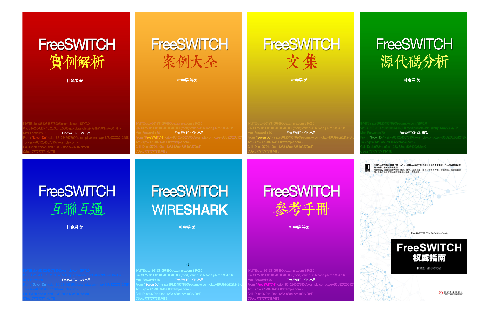
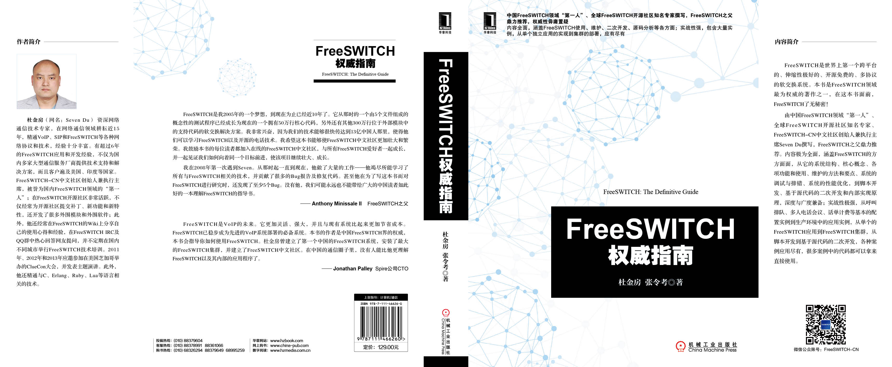

\let\cleardoublepage\clearpage

# 写在最后 {-}

本书将持续更新，这就是电子版的好处 ...

如果你对书中的内容和章节安排等有什么意见或建议，欢迎与我联系。如果你建议的内容适合放在本书里，我会考虑写进去；如果不适合放到本书中，我也会考虑写其它主题的书。

如果你的公司想在本书中植入广告或者赤裸裸地做广告，也欢迎与我们联系。

电子邮件：info@x-y-t.cn 。

# 作者简介 {-}

**杜金房**（网名：Seven） 资深网络通信技术专家，在网络通信领域耕耘近15年，精通VoIP、SIP和FreeSWITCH等各种网络协议和技术，经验十分丰富。有超过7年的FreeSWITCH应用和开发经验，不仅为国内大型通信服务厂商提供技术支持和解决方案，而且客户还遍及美国、印度等海外国家。

FreeSWITCH-CN中文社区创始人兼执行主席，被誉为国内FreeSWITCH领域的『第一人』；在FreeSWITCH开源社区非常活跃，不仅经常为开源社区提交补丁和新功能、新特性，而且还开发了很多外围模块和外围软件；此外，他经常在FreeSWITCH的Wiki上分享自己的使用心得和经验、在FreeSWITCH IRC、QQ及微信群中热心回答网友提问，并不定期在国内不同城市举行FreeSWITCH技术培训；自2011年起每年都应邀参加在美国芝加哥举办的ClueCon大会，并发表主题演讲。

此外，他还精通C、Erlang、Ruby、Lua等语言相关的技术。

著有[《FreeSWITCH权威指南》](http://book.dujinfang.com)，2014年出版。

创办了[北京信悦通科技有限公司](http://x-y-t.com)和[烟台小樱桃网络科技有限公司](http://x-y-t.cn)，提供FreeSWITCH培训和商业技术支持服务。

# 版权声明 {-}

本书版权归作者所有，任何人未经书面授权均不得分发此书。

本书电子版仅在小樱桃微信商城上发布。如果您不小心从其它渠道获得本书，请删除您的版本并到小樱桃商城上购买正版。

# 广告 {-}

## 关于广告的广告 {-}

请允许我在本书中发布广告。广告合作联系邮箱：info@x-y-t.cn 。

## FreeSWITCH第五届开发者沙龙将于2016年8月27日在京举行 {-}

<http://www.freeswitch.org.cn/2016.html>

## FreeSWITCH培训2016夏季班（北京站）将于2016年8月28-30日在京举行 {-}

<http://x-y-t.cn/fst1608.html>

## 烟台小樱桃网络科技有限公司提供商业FreeSWITCH及OpenSIPS技术支持 {-}

网址：<http://x-y-t.cn>
邮箱：info@x-y-t.cn

## 烟台小樱桃网络科技有限公司是潮流网络（GrandStream）山东总代理 {-}

深圳市潮流网络技术有限公司（Grandstream）是全球知名的统一通讯和整体解决方案厂商和全球TOP3 VoIP终端供应商，是国内IMS、统一通信、呼叫中心、调度市场、视频监控的主要SIP终端供货厂商，成功案例包括京东、网易、凡客诚品、平安、中集、东航、国家电网、中石化、中石油、外交部、中移动、中电信等等，公司是中国三大运营商IMS市场主要核心合作SIP终端厂商，入围中国电信集团IMS SIP电话短名单，持续配合运营商研究院SIP硬终端的核心业务及协议定制，参与及进入中电信、中移动多个省试点应用和产品供应厂商。在全球与渠道及增值合作伙伴成功服务将近千万终端用户，包括全球主流运营商数十万套终端以及美国共和党和美国民主党数万套SIP电话和网关等大型成功部署案例，连续10年保持近50%年复合增长率。

烟台小樱桃网络科技有限公司，是潮流全线产品在山东省的总代理。

联系方式：邮箱： info@x-y-t.cn  电话 0535-6753997

## FreeSWITCH相关图书 {-}

《FreeSWITCH文集》收集了一些FreeSWITCH文章，相比其它FreeSWITCH书来说，技术内容比较少，便于非技术人员快速了解FreeSWITCH。

《FreeSWITCH互联互通》主要收集了一些互联互通的例子。书中有些例子来自《FreeSWITCH权威指南》。

《FreeSWITCH实例解析》收集了一些如何使用FreeSWITCH的实际例子，方便读者参考。书中有些内容来自《FreeSWITCH权威指南》。

《FreeSWITCH案例大全》是一本众筹写作的书，里面收集了形形色色的案例。

《FreeSWITCH参考手册》里收集了FreeSWITCH相关的模块、API、APP、通道变量等各种参考。

《FreeSWITCH实战》是《FreeSWITCH权威指南》的前身，不再更新，但该书有其历史意义。

以上图书均有电子书和纸质书，可在小樱桃商城购买。

《FreeSWITCH权威指南》是正式出版的纸质书，纸质版和电子版均可在以下网站购买： <http://book.dujinfang.com> 。

# {-}

THIS PAGE INTENTIONALLY LEFT BLANK.
